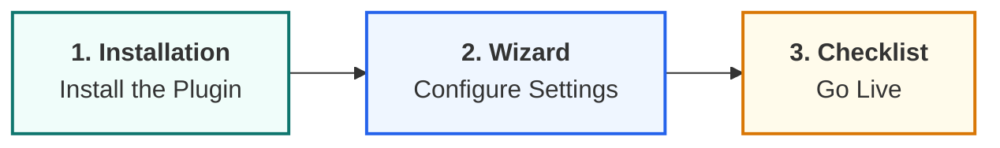

  

# 🚀 Getting Started Guide & Roadmap

Welcome to the MHM Rentiva documentation! We recommend following the steps below in order to install and configure the plugin as efficiently as possible.

:::tip QUICK SETUP
Use the cards below to quickly access the critical getting-started documents: installation, the wizard, and the checklist.
:::

---

  

    

      <h3 className="cardTitle">📦 1. Installation & Requirements</h3>
      
Server compatibility check, plugin installation, and license activation steps.

      <a className="button button--secondary button--block" href="./installation">Installation Guide</a>
    

  

  

    

      <h3 className="cardTitle">🧙 2. Setup Wizard</h3>
      
A step-by-step Setup Wizard guide that gets your system ready in minutes.

      <a className="button button--secondary button--block" href="./setup-wizard">Start the Wizard</a>
    

  

  

    

      <h3 className="cardTitle">✅ 3. Pre-Launch Checklist</h3>
      
Do a final review to make sure everything is in place before you go live.

      <a className="button button--secondary button--block" href="./post-install-checklist">Checklist</a>
    

  

---

## 📈 Visual Process Map

---

### Section Summary
- This guide is optimized to get your system up and running as quickly as possible.
- Each step builds on the configuration from the previous one.

## Changelog
| Date | Version | Note |
|---|---|---|
| 23.04.2026 | 4.27.2 | English translation added. |
| 19.03.2026 | 4.21.2 | Premium card-style roadmap created for the Getting Started guide. |
