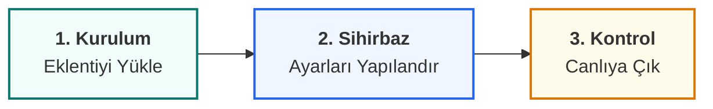

  

# 🚀 Başlangıç Rehberi ve Yol Haritası

MHM Rentiva dünyasına hoş geldiniz! Eklentiyi en verimli şekilde kurmak ve yapılandırmak için aşağıdaki adımları sırayla takip etmenizi öneririz.

:::tip HIZLI KURULUM
Aşağıdaki kartlar aracılığıyla kurulum, sihirbaz ve kontrol listesi gibi kritik başlangıç dökümanlarına hızlıca ulaşabilirsiniz.
:::

---

  

    

      <h3 className="cardTitle">📦 1. Kurulum ve Gereksinimler</h3>
      
Sunucu uyumluluk kontrolü, eklenti yükleme ve lisans aktivasyon süreçleri.

      <a className="button button--secondary button--block" href="/mhm-rentiva-docs/docs/getting-started/installation">Kurulum Rehberi</a>
    

  

  

    

      <h3 className="cardTitle">🧙 2. Kurulum Sihirbazı</h3>
      
Sistemi dakikalar içinde hazır hale getiren adım adım "Setup Wizard" rehberi.

      <a className="button button--secondary button--block" href="/mhm-rentiva-docs/docs/getting-started/setup-wizard">Sihirbazı Başlat</a>
    

  

  

    

      <h3 className="cardTitle">✅ 3. Yayın Öncesi Kontrol Listesi</h3>
      
Sitenizi canlıya almadan önce her şeyin yerli yerinde olduğunu son kez denetleyin.

      <a className="button button--secondary button--block" href="/mhm-rentiva-docs/docs/getting-started/post-install-checklist">Kontrol Listesi</a>
    

  

---

## 📈 Görsel Süreç Haritası

---

### Bölüm Özeti
- Bu rehber, sistemi en hızlı şekilde ayağa kaldırmanız için optimize edilmiştir.
- Her adım bir önceki yapılandırmaya dayanmaktadır.

## Değişiklik Günlüğü
| Tarih | Sürüm | Not |
|---|---|---|
| 19.03.2026 | 4.21.2 | Başlangıç Rehberi için premium kart tasarımlı yol haritası oluşturuldu. |
