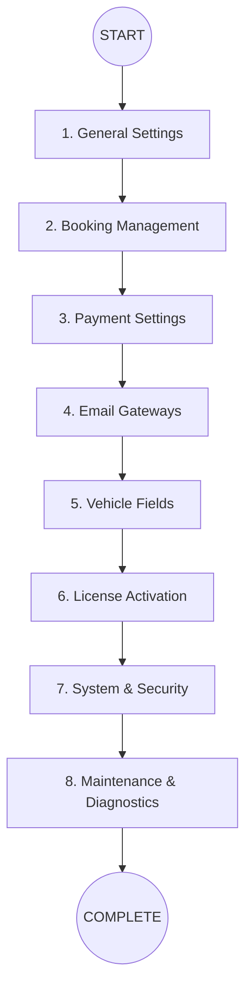

  

# ⚙️ Core Configuration Roadmap

After installing the plugin, settings need to be configured within a logical framework for operational processes to run smoothly. This section covers the core configuration steps that form the "heart" of the system.

:::tip CONFIGURATION GUIDE
Follow the categorized cards below to set up the system completely. Each card provides quick access to the relevant settings group.
:::

---

  

    

      <h3 className="cardTitle">🏢 1. General Settings</h3>
      
Define company information, currency, and core operating modes.

      <a className="button button--secondary button--block" href="/docs/core-configuration/settings">General Settings</a>
    

  

  

    

      <h3 className="cardTitle">📅 2. Booking</h3>
      
Rental durations, deposit rates, and booking behavior.

      <a className="button button--secondary button--block" href="/docs/core-configuration/booking-settings">Booking</a>
    

  

  

    

      <h3 className="cardTitle">💳 3. Payments</h3>
      
Configure WooCommerce payment gateways and collection rules.

      <a className="button button--secondary button--block" href="/docs/core-configuration/payments">Payment Settings</a>
    

  

  

    

      <h3 className="cardTitle">📧 4. Notifications</h3>
      
Email templates, SMTP settings, and automated notifications.

      <a className="button button--secondary button--block" href="/docs/core-configuration/emails">Email Settings</a>
    

  

  

    

      <h3 className="cardTitle">🏎️ 5. Vehicle Fields</h3>
      
Technical data (fuel type, transmission, etc.) and vehicle feature definitions.

      <a className="button button--secondary button--block" href="/docs/core-configuration/vehicle-settings">Vehicle Settings</a>
    

  

  

    

      <h3 className="cardTitle">🔑 6. License</h3>
      
Activate your key to unlock Pro features.

      <a className="button button--secondary button--block" href="/docs/core-configuration/license">License Management</a>
    

  

  

    

      <h3 className="cardTitle">⚡ 7. System & Performance</h3>
      
Caching, security rules, and system health checks.

      <a className="button button--secondary button--block" href="/docs/core-configuration/system-performance">System & Speed</a>
    

  

  

    

      <h3 className="cardTitle">🛠️ 8. Maintenance & Tools</h3>
      
Database cleanup, cron monitoring, and diagnostic tools.

      <a className="button button--secondary button--block" href="/docs/core-configuration/maintenance">Maintenance Page</a>
    

  

---

## 📈 Configuration Flow Diagram

---

### Section Summary
- Configuring settings in the correct order prevents system conflicts.
- It is recommended to validate the system with **Maintenance & Diagnostics** tools at the end.

## Changelog
| Date | Version | Note |
|---|---|---|
| 23.04.2026 | 4.27.2 | English translation added. |
| 19.03.2026 | 4.21.2 | Core Configuration roadmap with premium card design created. |
