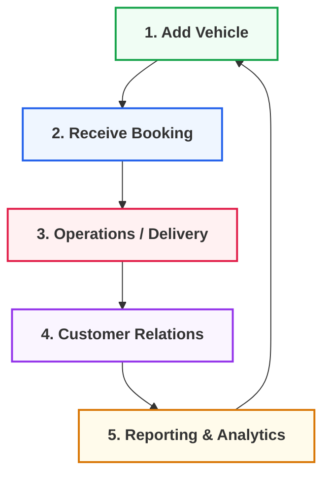

import Link from '@docusaurus/Link';

  

# 🚗 Features & Usage Roadmap

To get the most out of everything MHM Rentiva has to offer, we recommend following the operational order below.

:::tip USAGE GUIDE
Use the categorized cards below to manage your daily rental operations, add vehicles, and generate reports.
:::

---

  

    

      <h3 className="cardTitle">🏎️ 1. Vehicles & Inventory</h3>
      
Adding vehicles, category management, pricing, and global vehicle settings.

      <Link className="button button--secondary button--block" to="/docs/features-usage/vehicles">Vehicle Management</Link>
    

  

  

    

      <h3 className="cardTitle">📅 2. Booking Tracking</h3>
      
Manage incoming requests, monitor the calendar, and review booking details.

      <Link className="button button--secondary button--block" to="/docs/features-usage/bookings">Bookings</Link>
    

  

  

    

      <h3 className="cardTitle">✨ 3. Add-ons & VIP</h3>
      
Extras like baby seats and insurance, plus VIP transfer route definitions.

      <Link className="button button--secondary button--block" to="/docs/features-usage/additional-services-usage">Extra Services</Link>
    

  

  

    

      <h3 className="cardTitle">💬 4. Customers & Communication</h3>
      
Customer portal management, loyalty program, and internal messaging system.

      <Link className="button button--secondary button--block" to="/docs/features-usage/customers">Customer Management</Link>
    

  

  

    

      <h3 className="cardTitle">📊 5. Reporting & Analytics</h3>
      
Business performance charts, revenue reports, and data export.

      <Link className="button button--secondary button--block" to="/docs/features-usage/reports">Reports & Export</Link>
    

  

---

## 📈 Operational Cycle

---

### Section Summary
- This section covers the workflows for daily plugin usage.
- The operational cycle is designed for a sustainable rental business.

## Changelog
| Date | Version | Note |
|---|---|---|
| 23.04.2026 | 4.27.2 | English translation added. |
| 21.03.2026 | 4.21.3 | All card links (Vehicles, Bookings, Extra Services, etc.) corrected to relative paths. |
| 19.03.2026 | 4.21.2 | Features & Usage roadmap created with premium card design. |
