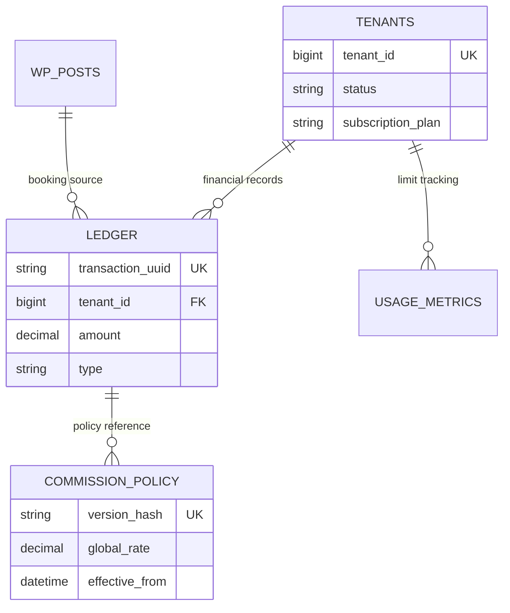

  

:::info Purpose
This page explains MHM Rentiva's hybrid database architecture (WP Core + Native Custom Tables), table schemas, and data integrity standards.
:::

# 🗄️ Database Architecture

MHM Rentiva uses a hybrid architecture that combines the **WordPress Post/User Meta** system with **High-Performance Custom Tables** to meet its requirements for performance and data integrity.

## 📊 Custom Tables

For financial records and SaaS operations, the plugin bypasses WordPress's standard tables and uses the following SQL-optimized tables directly:

| Table Name | Purpose | Critical Columns |
| :--- | :--- | :--- |
| `wp_mhm_rentiva_ledger` | Immutable financial ledger. | `transaction_uuid`, `amount`, `tenant_id` |
| `wp_mhm_rentiva_commission_policy` | Versioned records of commission policies. | `version_hash`, `global_rate`, `effective_from` |
| `wp_mhm_rentiva_tenants` | Multi-tenant records and quotas. | `tenant_id`, `status`, `subscription_plan` |
| `wp_mhm_rentiva_usage_metrics` | SaaS usage limits and metric tracking. | `metric_type`, `metric_value`, `cycle_start` |

### 🏗️ Data Integrity Principles
- **Immutability:** Records in the `ledger` table are never updated or deleted. Corrections are made by creating a new offsetting entry.
- **Tenant Isolation:** The `tenant_id` column is present in all custom tables. Data is logically isolated at the database level.
- **Audit Trail:** Commission policies are signed with a `version_hash` (SHA-256) to create a financial audit trail.

---

## 🔑 Meta Key Standards

Operational data (vehicle attributes, customer preferences, etc.) is stored in WordPress meta tables using the following prefix convention:
`_mhm_rentiva_[category]_[field_name]`

| Category | Example Key |
| :--- | :--- |
| **Vehicle** | `_mhm_rentiva_vehicle_license_plate` |
| **Booking** | `_mhm_rentiva_booking_payout_status` |
| **Customer** | `_mhm_rentiva_customer_banned` |

---

## 🧬 Table Relationships (ER)

---

## Transfer Tables

Two custom tables are used by the Transfer module:

| Table Name | Purpose | Critical Columns |
| :--- | :--- | :--- |
| `wp_rentiva_transfer_locations` | Transfer points (airport, hotel, port, etc.) | `name`, `type`, `city`, `lat`, `lng` |
| `wp_rentiva_transfer_routes` | Route definitions between two locations | `origin_id`, `destination_id`, `base_price`, `min_price`, `max_price`, `distance_km` |

### DatabaseMigrator v3.4.0 Changes
- `city` VARCHAR(100) column added to `rentiva_transfer_locations` table (for vendor marketplace city-based filtering).
- `max_price` DECIMAL(10,2) column added to `rentiva_transfer_routes` table (upper bound for vendor price range).

---

## Maintenance and Development

- **Migrations:** The database schema is defined under `src/Core/Database/Migrations/`. The `MultiTenantMigration` and `LedgerMigration` classes perform safe updates using `dbDelta`.
- **Audit Tool:** Database consistency can be verified with the `wp mhm-rentiva audit` CLI commands.

---

## Uninstaller Table List

The following tables are removed when the plugin is uninstalled:

| Table | Category |
|---|---|
| `wp_mhm_rentiva_ledger` | Financial |
| `wp_mhm_rentiva_commission_policy` | Financial |
| `wp_mhm_rentiva_tenants` | SaaS |
| `wp_mhm_rentiva_usage_metrics` | SaaS |
| `wp_mhm_notification_queue` | System |
| `wp_mhm_payment_log` | System |
| `wp_mhm_sessions` | System |
| `wp_rentiva_transfer_locations` | Transfer |
| `wp_rentiva_transfer_routes` | Transfer |

Legacy `mhm_rentiva_transfer_*` tables are also removed if present.

## Section Summary
- Critical financial data is managed via SQL on **Custom Tables**.
- Transfer tables support the vendor marketplace with `city` and `max_price` columns.
- Flexible data is stored in the **WP Meta** system.
- The **multi-tenancy** structure propagates the `tenant_id` parameter across all layers.
- The Uninstaller removes 9 custom tables plus any legacy tables.

## Changelog
| Date | Version | Note |
|---|---|---|
| 23.04.2026 | 4.27.2 | English translation added. |
| 27.03.2026 | 4.23.0 | Transfer tables (locations + routes), DatabaseMigrator v3.4.0 changes (city, max_price), and Uninstaller table list (9 tables + legacy) added. |
| 19.03.2026 | 4.23.0 | Database documentation rewritten for SaaS and Financial architecture. |
