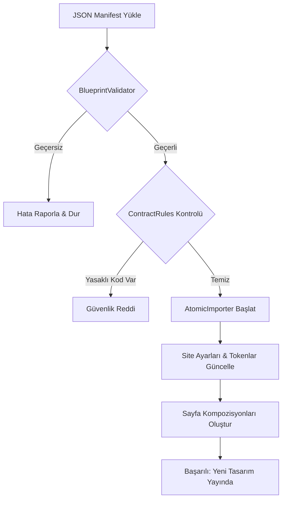

  

:::info Amaç
Bu sayfa; tasarım manifestlerinin (JSON) sisteme nasıl aktarıldığını, doğrulama (Validation) aşamalarını ve atomik içe aktarma sürecini açıklar.
:::

# 🏗️ Layout Import Pipeline

MHM Rentiva, temadan bağımsız bir tasarım sistemi kullanır. Bu sistem, **Layout Manifest** adı verilen JSON dosyalarının işlenmesiyle çalışır. Süreç, hatalı bir tasarımın sistemi bozmasını engellemek için çok katmanlı bir doğrulama hattından geçer.

## 🛠️ Ana Bileşenler

Sistem şu sınıflar üzerinden koordine edilir:

| Bileşen | Görevi |
| :--- | :--- |
| `BlueprintValidator` | Manifest JSON dosyasının yapısal ve mantıksal doğruluğunu kontrol eder. |
| `AtomicImporter` | Değişiklikleri tek bir veritabanı işleminde (Transaction) uygular. |
| `ContractRules` | Tasarımın uyması gereken katı kuralları (Örn: Tailwind sınıflarının yasağı) tanımlar. |
| `LayoutRollbackService` | Hata durumunda sistemi bir önceki kararlı tasarıma döndürür. |

---

## 🔄 İş Akışı (Pipeline Sequence)

Bir tasarım dosyası yüklendiğinde şu aşamalardan geçer:

---

## 🛡️ Güvenlik ve Doğrulama Kuralları

### 1. Yapısal Doğrulama (`BlueprintValidator`)
Manifest dosyasında şu kök anahtarların bulunması zorunludur:
- `version`: Manifest sürümü (v1.x desteklenir).
- `pages`: Sayfa tasarımları ve slug tanımları.
- `tokens`: Renk, tipografi ve boşluk değişkenleri.
- `components`: Kullanılan bileşenlerin listesi.

### 2. Yasaklı Desen Taraması (`ContractRules`)
Mevcut mimari, CSS sızıntılarını ve performans sorunlarını engellemek için manifestler içerisinde **Tailwind CSS** sınıflarının veya satır içi (inline) ağır stil tanımlarının kullanımını yasaklamıştır. `BlueprintValidator` bu desenleri algıladığında işlemi otomatik olarak iptal eder.

---

## 💾 Atomik İşlemler ve Geri Dönüş (Rollback)

Import işlemi **Atomik** (ya hep ya hiç) prensibiyle çalışır. 
- Eğer 10 sayfalık bir manifestin 9. sayfasında bir hata oluşursa, daha önce güncellenen 8 sayfa da eski haline geri döndürülür.
- Bu işlem `LayoutRollbackService` tarafından yönetilir ve veritabanı bütünlüğünü korur.

---

## 🛠️ Geliştirici Notları

- **Manifest Versiyonu:** Şu an sadece `1.0.0` tabanlı tasarımlar desteklenmektedir.
- **Cache:** Başarılı bir import sonrası platformun Object Cache (Redis/Memcached) belleği otomatik olarak temizlenir.
- **Log:** Tüm import işlemleri `AdvancedLogger` üzerinden `layout_ingestion` kanalıyla takip edilebilir.

## Bölüm Sonu Özeti
- Pipeline, **"Önce Doğrula, Sonra Yaz"** prensibiyle çalışır.
- Tasarım hataları çalışma zamanında (Runtime) değil, içe aktarma (Import) sırasında yakalanır.
- Hata durumunda sistem otomatik olarak bir önceki kararlı sürüme (Rollback) döner.

## Değişiklik Günlüğü
| Tarih | Sürüm | Not |
|---|---|---|
| 19.03.2026 | 4.21.2 | Sayfa, v1.9 mimarisine ve güncel validator kurallarına göre normalize edildi. |
