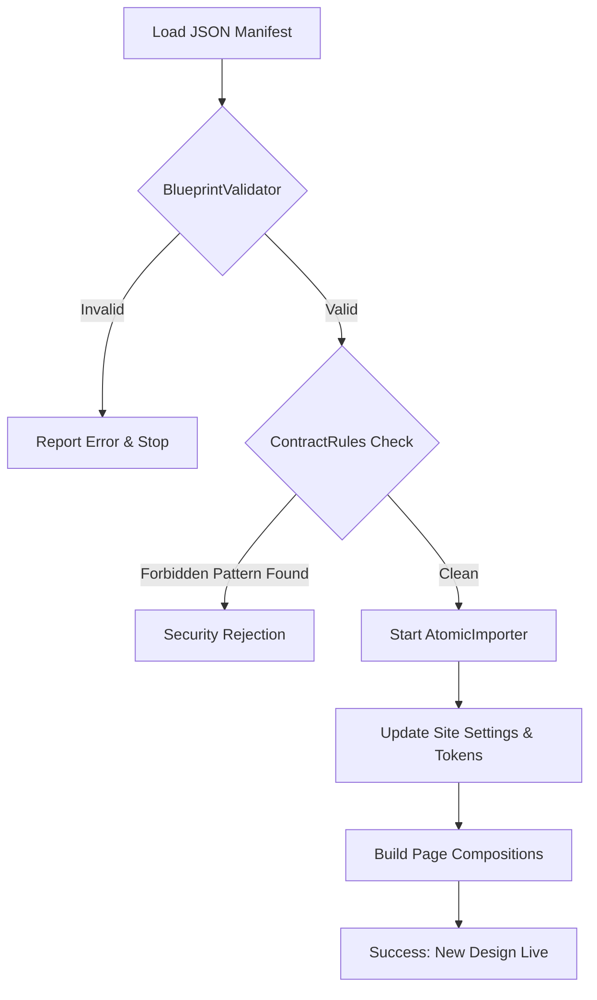

  

:::info Purpose
This page explains how design manifests (JSON) are imported into the system, the validation stages, and the atomic import process.
:::

# 🏗️ Layout Import Pipeline

MHM Rentiva uses a theme-independent design system. This system works by processing JSON files called **Layout Manifests**. The process passes through a multi-layered validation pipeline to prevent a faulty design from breaking the system.

## 🛠️ Core Components

The system is coordinated through the following classes:

| Component | Role |
| :--- | :--- |
| `BlueprintValidator` | Checks the structural and logical correctness of the manifest JSON file. |
| `AtomicImporter` | Applies changes within a single database transaction. |
| `ContractRules` | Defines strict rules the design must follow (e.g., prohibition of Tailwind classes). |
| `LayoutRollbackService` | Reverts the system to the previous stable design in case of error. |

---

## 🔄 Workflow (Pipeline Sequence)

When a design file is uploaded, it passes through the following stages:

---

## 🛡️ Security and Validation Rules

### 1. Structural Validation (`BlueprintValidator`)
The following root keys must be present in the manifest file:
- `version`: Manifest version (v1.x supported).
- `pages`: Page designs and slug definitions.
- `tokens`: Color, typography, and spacing variables.
- `components`: List of components used.

### 2. Forbidden Pattern Scan (`ContractRules`)
The current architecture prohibits the use of **Tailwind CSS** classes or heavy inline style definitions inside manifests, to prevent CSS leakage and performance issues. When `BlueprintValidator` detects these patterns, it automatically aborts the operation.

---

## 💾 Atomic Operations and Rollback

The import operation works on an **Atomic** (all-or-nothing) principle.
- If an error occurs on page 9 of a 10-page manifest, the 8 pages already updated are also reverted to their previous state.
- This is managed by `LayoutRollbackService` and preserves database integrity.

---

## 🛠️ Developer Notes

- **Manifest Version:** Currently only `1.0.0`-based designs are supported.
- **Cache:** After a successful import, the platform's Object Cache (Redis/Memcached) is automatically flushed.
- **Log:** All import operations can be tracked through `AdvancedLogger` via the `layout_ingestion` channel.

## Section Summary
- The pipeline operates on a **"Validate First, Then Write"** principle.
- Design errors are caught at import time, not at runtime.
- On failure, the system automatically rolls back to the previous stable version.

## Changelog
| Date | Version | Note |
|---|---|---|
| 23.04.2026 | 4.27.2 | English translation added. |
| 19.03.2026 | 4.21.2 | Page normalized to v1.9 architecture and current validator rules. |
