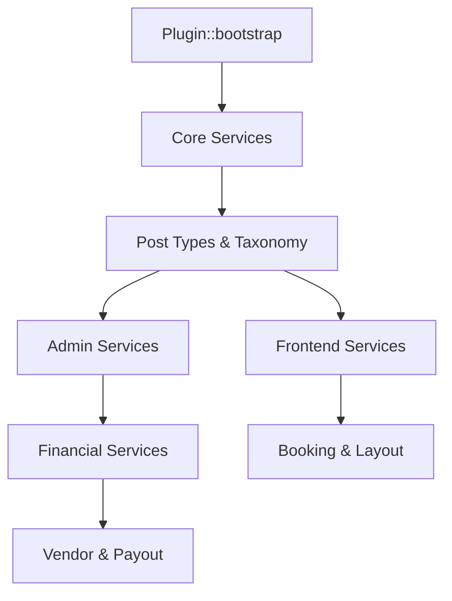

  

:::info Amaç
Bu belge, Rentiva modüllerinin sorumluluk sınırlarını, veri akışını ve servisler arası bağımlılık hiyerarşisini teknik bir referans olarak toplar.
:::

# 🧱 MHM Rentiva Modül Mimarisi

MHM Rentiva, **"Modüler Monolit"** yaklaşımıyla geliştirilmiştir. Her modül kendi içinde bağımsız bir "Service" veya "Manager" olarak tasarlanmış, ancak tüm sistem `MHMRentiva\Plugin` ana sınıfı (Service Graph) üzerinden koordine edilmektedir.

## 🚀 Service Graph ve Önyükleme (Bootstrap)

Eklenti, performans ve öngörülebilirlik için katı bir servis başlatma sırası izler. `Plugin::initialize_services()` metodu bu hiyerarşiyi yönetir.

### 📊 Modüller Arası Hiyerarşi

---

## 📂 Modül Kategorileri ve Sorumluluklar

| Kategori | Namespace | Sorumluluk |
| :--- | :--- | :--- |
| **Core** | `MHMRentiva\Core` | Veritabanı (Migrations), Güvenlik (Governance), Lisans Kontrolü (Licensing). |
| **Admin** | `MHMRentiva\Admin` | Panel arayüzleri, Liste tabloları (ListTables), Ayar sayfaları. |
| **Financial** | `MHMRentiva\Core\Financial` | Ledger (Defter) kayıtları, Komisyon politikaları, Payout yönetimi. |
| **Layout** | `MHMRentiva\Layout` | Manifest doğrulaması, Atomik Import, Tasarım token yönetimi. |
| **API** | `MHMRentiva\Api` | REST-API endpointleri, Webhook yönetimleri ve JSON dökümleri. |

---

## 🛠️ Temel Mimari Prensipler

### 1. Singleton ve Statik Erişim
Çekirdek sınıflar (Örn: `Plugin.php`) Singleton deseniyle çalışır. Bu, aynı request içinde servislerin birden fazla kez başlatılmasını engelleyerek bellek kullanımını optimize eder.

### 2. Dependency Injection (Gevşek Bağlılık)
Modüller birbirlerine doğrudan sıkı bağlı değildir. Bir modün çalışıp çalışmayacağı `is_class_available()` kontrolü ve lisans kapısı üzerinden dinamik olarak belirlenir.

### 3. Event-Driven Mimari (Hooks)
Sistem, WordPress'in `add_action` ve `add_filter` ekosistemini kullanarak genişletilebilir. Örneğin; bir rezervasyon tamamlandığında (`mhm_rentiva_booking_completed`), finansal kayıtlar (Ledger) otomatik tetiklenir.

---

## 🛡️ Güvenlik ve Uyumluluk

Her modül şu güvenlik protokollerine uymak zorundadır:
- **Sanitizasyon:** Tüm girdi verileri `Sanitizer::text_field_safe()` gibi yardımcı sınıflarla temizlenir.
- **Nonce & Capability:** Admin tarafındaki her istek için `current_user_can()` ve `check_admin_referer()` kontrolleri standarttır.
- **Audit Logs:** Finansal veya mimari her kritik işlem `AdvancedLogger` ile kayıt altına alınır.

## Bölüm Sonu Özeti
- Sistem servis tabanlı bir graf (Service Graph) üzerinde yükselir.
- **Core** modülü en altta yer alan ve tüm sistemi taşıyan temeldir.
- Modüller arası iletişim hooks (event-driven) veya merkezi servis çağrılarıyla yapılır.

## Değişiklik Günlüğü
| Tarih | Sürüm | Not |
|---|---|---|
| 19.03.2026 | 4.21.2 | Sayfa, Service Graph ve Modüler Monolit detaylarıyla güncellendi. |
