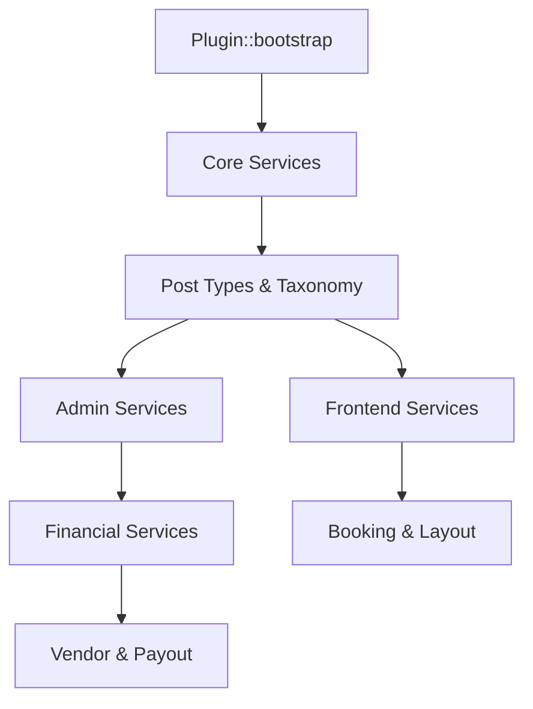

  

:::info Purpose
This document brings together the responsibility boundaries, data flow, and inter-service dependency hierarchy of Rentiva's modules as a technical reference.
:::

# 🧱 MHM Rentiva Module Architecture

MHM Rentiva is built using a **"Modular Monolith"** approach. Each module is designed as a self-contained "Service" or "Manager", but the entire system is coordinated through the `MHMRentiva\Plugin` root class (Service Graph).

## 🚀 Service Graph and Bootstrap

For performance and predictability, the plugin follows a strict service initialization order. The `Plugin::initialize_services()` method manages this hierarchy.

### 📊 Inter-Module Hierarchy

---

## 📂 Module Categories and Responsibilities

| Category | Namespace | Responsibility |
| :--- | :--- | :--- |
| **Core** | `MHMRentiva\Core` | Database (Migrations), Security (Governance), License checks (Licensing). |
| **Admin** | `MHMRentiva\Admin` | Admin UIs, List tables (ListTables), Settings pages. |
| **Financial** | `MHMRentiva\Core\Financial` | Ledger entries, Commission policies, Payout management. |
| **Layout** | `MHMRentiva\Layout` | Manifest validation, Atomic Import, Design token management. |
| **API** | `MHMRentiva\Api` | REST API endpoints, Webhook handlers, and JSON outputs. |

---

## 🛠️ Core Architectural Principles

### 1. Singleton and Static Access
Core classes (e.g., `Plugin.php`) use the Singleton pattern. This prevents services from being initialized more than once per request, optimizing memory usage.

### 2. Dependency Injection (Loose Coupling)
Modules are not tightly coupled to each other. Whether a module runs or not is determined dynamically via `is_class_available()` checks and the license gate.

### 3. Event-Driven Architecture (Hooks)
The system is extensible through WordPress's `add_action` and `add_filter` ecosystem. For example, when a booking is completed (`mhm_rentiva_booking_completed`), the financial records (Ledger) are triggered automatically.

---

## 🛡️ Security and Compliance

Every module must follow these security protocols:
- **Sanitization:** All input is cleaned through helper classes such as `Sanitizer::text_field_safe()`.
- **Nonce & Capability:** `current_user_can()` and `check_admin_referer()` checks are standard for every admin-side request.
- **Audit Logs:** Every critical financial or architectural operation is recorded via `AdvancedLogger`.

## Section Summary
- The system is built on a service-based graph (Service Graph).
- The **Core** module is the foundation at the bottom that supports the entire system.
- Inter-module communication happens through hooks (event-driven) or central service calls.

## Changelog
| Date | Version | Note |
|---|---|---|
| 23.04.2026 | 4.27.2 | Documentation translated into English. |
| 19.03.2026 | 4.21.2 | Page updated with Service Graph and Modular Monolith details. |
