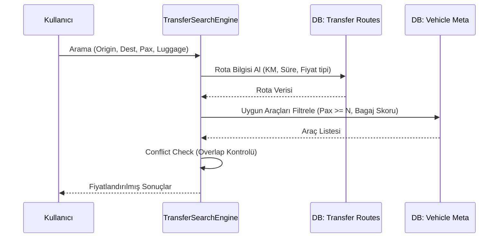

  

:::info Amaç
Bu sayfa, transfer modülünün çekirdek sınıflarını, rota bazlı fiyatlandırma motorunu ve veri akışını açıklar.
:::

# 🚕 MHM Rentiva Transfer Mimarisi

Transfer modülü, araç kiralama modülünden farklı olarak "Zaman + Konum" tabanlı bir arama ve fiyatlandırma motoru üzerine kurulu bir alt sistemdir.

## 🛠️ Ana Bileşenler (Sınıf Haritası)

Transfer operasyonları şu temel sınıflar tarafından yönetilir:

| Sınıf | Görevi |
| :--- | :--- |
| `TransferSearchEngine` | Rota, kapasite, müsaitlik ve bagaj skoru filtrelerini uygulayan ana motor. |
| `TransferShortcodes` | Frontend arama formları ve sonuç listelerini (`[rentiva_transfer_search]`) yönetir. |
| `TransferCartIntegration` | Seçilen transfer hizmetini WooCommerce sepetine entegre eder. |
| `TransferBookingHandler` | Checkout sonrası transfer detaylarını (Rota ID, KM, Süre) rezervasyona kaydeder. |

---

## 🔄 Veri Akışı ve Arama Süreci

 Bir transfer araması yapıldığında sistem şu adımları izler:

---

## 🔍 Fiyatlandırma ve Kapasite Mantığı

### 1. Rota Bazlı Fiyatlandırma
Transfer fiyatları `wp_mhm_rentiva_transfer_routes` tablosundaki kurallara göre hesaplanır:
- **Sabit (Fixed):** Belirlenen `base_price` doğrudan uygulanır.
- **Mesafe (Distance):** `base_price * distance_km` formülü kullanılır. Opsiyonel olarak `min_price` alt sınırı eklenebilir.
- **Çarpan (Multiplier):** Araç bazlı çarpan (`_mhm_transfer_price_multiplier`) ile VIP araçlar için fiyat otomatik artırılabilir.

### 2. Bagaj Skoru Hesaplama
Sistem, araçların bagaj kapasitesini şu matematiksel modelle hesaplar:
`Luggage Score = (Küçük Bagaj * 1) + (Büyük Bagaj * 2.5)`
Arama sırasında istenen bagaj yükü, aracın `_mhm_transfer_max_luggage_score` değerinden büyükse araç elenir.

---

## 🛡️ Kritik Hook ve Aksiyonlar

- **AJAX Arama:** `mhm_rentiva_transfer_search_results` - Arama sonuçlarını döndürür.
- **Sepete Ekleme:** `rentiva_transfer_add_to_cart` - Transfer verilerini meta alanlarıyla sepete yollar.
- **Sipariş Oluşturma:** `woocommerce_checkout_create_order_line_item` - Rota detaylarını kalıcı sipariş kaydına dönüştürür.

## Bölüm Sonu Özeti
- Transfer modülü, rota tabanlı çalışan bağımsız bir fiyatlama motorudur.
- **Bagaj Skoru** ve **Yolcu Kapasitesi** en kritik veri filtreleridir.
- Rezervasyon çakışmaları `Util::has_overlap()` üzerinden çekirdek sistemle ortak kontrol edilir.

## Değişiklik Günlüğü
| Tarih | Sürüm | Not |
|---|---|---|
| 19.03.2026 | 4.21.2 | Transfer mimarisi, rota bazlı fiyatlandırma ve bagaj yönetimi detaylarıyla güncellendi. |
