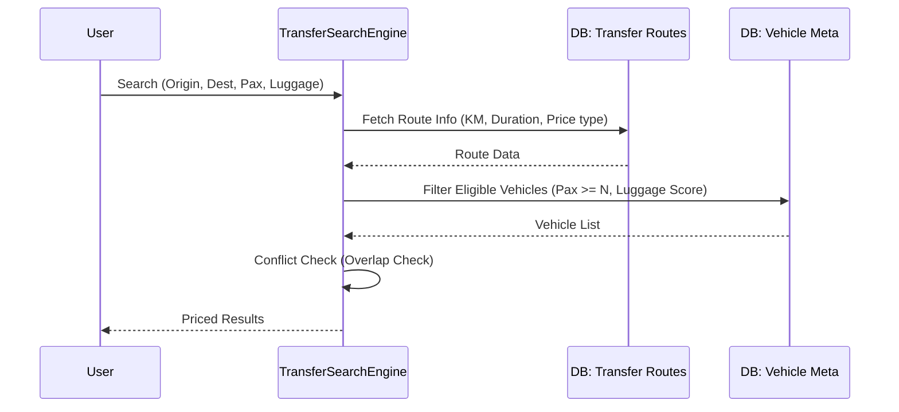

  

:::info Purpose
This page explains the core classes of the Transfer module, the route-based pricing engine, and the data flow.
:::

# 🚕 MHM Rentiva Transfer Architecture

The Transfer module is a subsystem built on a "Time + Location" based search and pricing engine, distinct from the vehicle rental module.

## 🛠️ Core Components (Class Map)

Transfer operations are managed by the following core classes:

| Class | Role |
| :--- | :--- |
| `TransferSearchEngine` | The main engine that applies route-based vehicle filtering, vendor pricing, and luggage score filters. |
| `LocationProvider` | Location query service; supports city-based filtering via the `get_by_city()` method. |
| `TransferShortcodes` | Manages frontend search forms and result listings (`[rentiva_transfer_search]`). |
| `TransferCartIntegration` | Integrates the selected transfer service into the WooCommerce cart. |
| `TransferBookingHandler` | Saves transfer details (Route ID, KM, Duration) to the booking after checkout. |

---

## 🔄 Data Flow and Search Process

When a transfer search is performed, the system follows these steps:

---

## 🔍 Pricing and Capacity Logic

### 1. Route-Based Pricing
Transfer prices are calculated based on the rules in the `wp_rentiva_transfer_routes` table:
- **Fixed:** The defined `base_price` is applied directly.
- **Distance:** The formula `base_price * distance_km` is used. Optionally, a `min_price` floor can be added.
- **Multiplier:** A per-vehicle multiplier (`_mhm_transfer_price_multiplier`) allows automatic price increases for VIP vehicles.

### 1a. Vendor Pricing (v4.23.0)
Pricing works as follows in the vendor marketplace integration:
- The admin sets a `min_price` and `max_price` range for each route.
- The vendor assigns a route-based price to their own vehicle (`_mhm_rentiva_transfer_route_prices` JSON meta).
- `TransferSearchEngine` checks the vendor price first; if absent, it falls back to the route `base_price`.
- If the vendor price is outside the admin's range, it is considered invalid.

### 2. Luggage Score Calculation
The system calculates a vehicle's luggage capacity using the following mathematical model:
`Luggage Score = (Small Bags * 1) + (Large Bags * 2.5)`
During search, if the requested luggage load exceeds the vehicle's `_mhm_transfer_max_luggage_score` value, the vehicle is excluded.

---

## 🛡️ Critical Hooks and Actions

- **AJAX Search:** `mhm_rentiva_transfer_search_results` — Returns search results.
- **Add to Cart:** `rentiva_transfer_add_to_cart` — Sends transfer data with meta fields to the cart.
- **Order Creation:** `woocommerce_checkout_create_order_line_item` — Converts route details into a permanent order record.

## City-Based Filtering (v4.23.0)

The `LocationProvider::get_by_city()` method queries locations in the city where the vendor is registered. This structure is used as follows:

1. In the vendor vehicle submission form (`VehicleSubmit.php`), only locations and routes in the vendor's own city are displayed.
2. In the admin panel, `VehicleTransferMetaBox` displays the vendor's city information.

---

## Vehicle Meta Structure

The Transfer module uses the following meta keys:

| Meta Key | Type | Description |
|---|---|---|
| `_mhm_rentiva_transfer_locations` | array | Location IDs the vehicle serves |
| `_mhm_rentiva_transfer_routes` | array | Route IDs the vehicle serves |
| `_mhm_rentiva_transfer_route_prices` | JSON | Route-based vendor prices (`{route_id: price}`) |

---

## Section Summary
- The Transfer module is an independent, route-based pricing engine.
- **Vendor pricing:** Admin sets the `min_price`/`max_price` range; vendors set their own price.
- **City filtering:** With `LocationProvider::get_by_city()`, vendors only see routes in their own city.
- **Luggage Score** and **Passenger Capacity** are the most critical data filters.
- Booking conflicts are checked via `Util::has_overlap()`, shared with the core system.

## Changelog
| Date | Version | Note |
|---|---|---|
| 23.04.2026 | 4.27.2 | English translation added. |
| 27.03.2026 | 4.23.0 | Vendor pricing, `LocationProvider::get_by_city()`, city-based filtering, and vehicle meta keys added. |
| 19.03.2026 | 4.21.2 | Transfer architecture updated with route-based pricing and luggage management details. |
