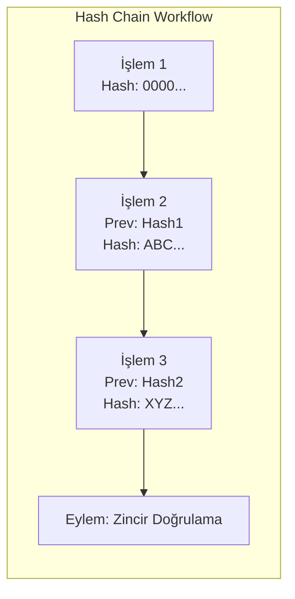

  

:::info Amaç
Bu sayfa, finansal denetim (Audit) süreçlerinde kullanılan dijital imzalama, anahtar yönetimi ve veri bütünlüğü (Hash-Chain) modellerini açıklar.
:::

# 🔐 Audit Kriptografi ve Bütünlük

MHM Rentiva, finansal raporların ve dışa aktarılan (Export) verilerin manipüle edilmediğini garanti altına almak için askeri düzeyde kriptografik standartlar kullanır.

## 🛠️ Teknik Bileşenler

Kriptografik güvenlik katmanı şu servisler tarafından yönetilir:

| Servis | Görev | Algoritma |
| :--- | :--- | :--- |
| `ExportSignatureService` | Dışa aktarılan dosyaları (CSV/JSON) imzalar. | **Ed25519** (Detached) |
| `KeyPairManager` | Sistem anahtar çiftlerini (Private/Public) yönetir. | **Libsodium** tabanlı |
| `HashChainService` | Finansal olayları birbirine bağlı bir zincir haline getirir. | **SHA-256** |

---

## ⚡ Hash-Chain (Bütünlük Zinciri) Modeli

Her finansal işlem, kendisinden önceki işlemin hash değerini referans alarak kaydedilir. Bu yapı, veri tabanındaki tek bir satır dahi değiştirilirse zincirin kırılmasını ve manipülasyonun anında tespit edilmesini sağlar.

---

## 🖋️ Dosya İmzalama Akışı (Ed25519)

Bir denetim raporu (Audit Export) oluşturulduğunda şu süreç işler:

1.  **Payload Hazırlama:** Veriler CSV veya JSON olarak üretilir.
2.  **Hex Hash Üretimi:** Dosyanın içeriği `SHA-256` ile özetlenir (File Hash).
3.  **Dijital İmzalama:** Bu özet değer, sistemin aktif `Private Key`'i ile Ed25519 algoritmaı kullanılarak imzalanır.
4.  **Doğrulama Anahtarı:** İmza ile birlikte `Key ID` export paketine eklenir.

:::important Doğrulama
İmza doğrulaması için sadece `Public Key` yeterlidir. Bu, verileri alan denetçinin (Auditor), verinin MHM Rentiva sisteminden çıktığını ve yolda değişmediğini kanıtlamasına olanak tanır.
:::

---

## 🔑 Anahtar Yönetimi (Key Management)

- **Sessiz Üretim:** Anahtarlar ilk kurulumda veya `KeyPairManager` üzerinden manuel olarak üretilir.
- **Güvenli Saklama:** `Private Key` veritabanında şifrelenmiş (Encrypted) olarak saklanır veya çevre değişkeni (Env) üzerinden okunabilir.
- **Rotation (Döngü):** Periyodik olarak anahtar değişimi yapılması ve eski anahtarların "Archive" durumuna çekilmesi önerilir.

## Bölüm Sonu Özeti
- Sistem, **Ed25519** ile yüksek performanslı ve güvenli imzalama yapar.
- **Hash-Chain** yapısı, geriye dönük veri manipülasyonunu imkansız kılar.
- Finansal veriler hem veritabanında hem de dışa aktarıldığında korunur.

## Değişiklik Günlüğü
| Tarih | Sürüm | Not |
|---|---|---|
| 19.03.2026 | 4.21.2 | Sayfa, Ed25519 ve Hash-Chain mimari detaylarıyla güncellendi. |
