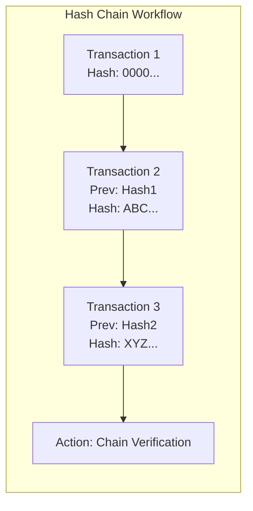

  

:::info Purpose
This page describes the digital signing, key management, and data integrity (Hash-Chain) models used in financial audit processes.
:::

# 🔐 Audit Cryptography and Integrity

MHM Rentiva uses military-grade cryptographic standards to guarantee that financial reports and exported data have not been tampered with.

## 🛠️ Technical Components

The cryptographic security layer is managed by the following services:

| Service | Responsibility | Algorithm |
| :--- | :--- | :--- |
| `ExportSignatureService` | Signs exported files (CSV/JSON). | **Ed25519** (Detached) |
| `KeyPairManager` | Manages system key pairs (Private/Public). | **Libsodium**-based |
| `HashChainService` | Links financial events into a chained sequence. | **SHA-256** |

---

## ⚡ Hash-Chain (Integrity Chain) Model

Each financial transaction is recorded by referencing the hash value of the previous transaction. This structure ensures that if even a single row in the database is altered, the chain breaks and the manipulation is detected immediately.

---

## 🖋️ File Signing Flow (Ed25519)

When an audit report (Audit Export) is generated, the following process runs:

1.  **Payload Preparation:** Data is produced as CSV or JSON.
2.  **Hex Hash Generation:** The file content is hashed using `SHA-256` (File Hash).
3.  **Digital Signing:** This digest is signed using the system's active `Private Key` with the Ed25519 algorithm.
4.  **Verification Key:** The `Key ID` is included in the export package alongside the signature.

:::important Verification
Only the `Public Key` is needed for signature verification. This allows the auditor receiving the data to prove that it originated from the MHM Rentiva system and was not altered in transit.
:::

---

## 🔑 Key Management

- **Silent Generation:** Keys are generated on first installation or manually via `KeyPairManager`.
- **Secure Storage:** The `Private Key` is stored encrypted in the database or can be read from an environment variable (Env).
- **Rotation:** Periodic key rotation is recommended; old keys should be moved to "Archive" status.

## Section Summary
- The system uses **Ed25519** for high-performance, secure signing.
- The **Hash-Chain** structure makes retroactive data manipulation impossible.
- Financial data is protected both in the database and during export.

## Changelog
| Date | Version | Note |
|---|---|---|
| 23.04.2026 | 4.27.2 | English translation added. |
| 19.03.2026 | 4.21.2 | Page updated with Ed25519 and Hash-Chain architecture details. |
