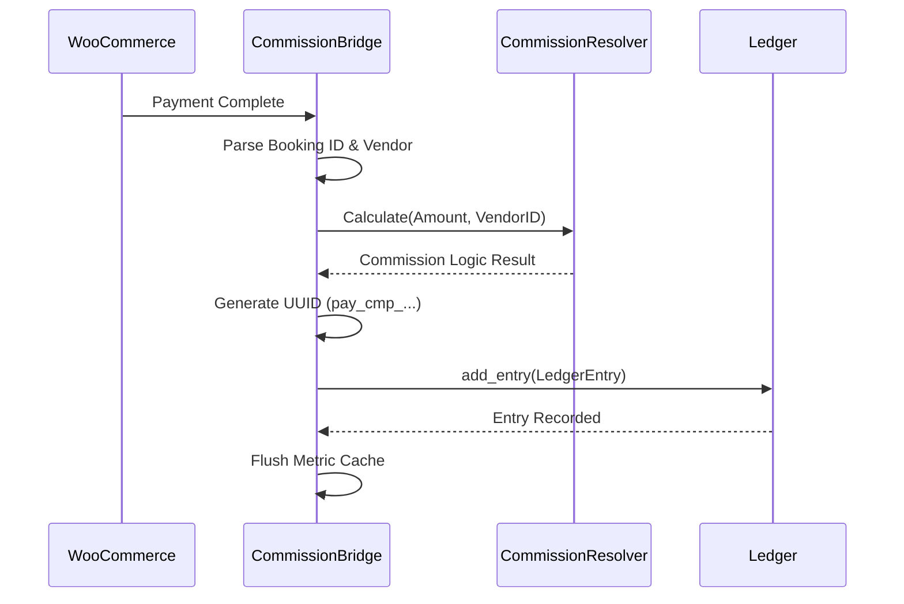

  

:::info Purpose
This page describes how the `CommissionBridge` component manages the data flow between WooCommerce orders and the Rentiva financial core (Ledger).
:::

# 🌉 WooCommerce Commission Bridge

`CommissionBridge` acts as a translator between the e-commerce layer (WooCommerce) and the financial recording layer (Ledger). It listens to order events and converts them into financial Ledger entries.

## 🚀 Trigger Events (Hooks)

The bridge operates by monitoring the following critical WooCommerce events:

- **`woocommerce_payment_complete`**: Fired when payment is successfully completed.
- **`woocommerce_order_status_completed`**: Fired when an order is marked complete, manually or automatically.
- **`woocommerce_order_refunded`**: Used to create a Reverse Entry for refund operations.

---

## 🔄 Financial Processing Flow

When an order is paid, the system follows these steps:

---

## 🛠️ Key Features and Logic

### 1. Idempotency (Duplicate Entry Prevention)
A unique **UUID** in the format `pay_cmp_{order_id}_{booking_id}` is generated for each entry. Even if WooCommerce fires the same event multiple times, the `Ledger` class prevents duplicate entries thanks to this UUID.

### 2. Refund and Reverse Entry Handling
When an order is refunded (`on_order_refunded`), instead of deleting the existing entry, the system creates a new **Refund Entry** with opposite values (`-` balance). This is required for financial audit trail integrity.

### 3. Metric Synchronization
As soon as a financial entry is written to the Ledger, `MetricCacheManager` is triggered so that Vendor- and Vehicle-based performance charts are updated immediately.

---

## 📋 Data Mapping

| WooCommerce Field | Ledger Field | Description |
| :--- | :--- | :--- |
| `order_id` | `parent_id` / `source_id` | Indicates the source is a WC order. |
| `order_total` | `gross_amount` | Total amount including tax. |
| `currency` | `currency` | Currency of the order. |
| `_mhm_booking_id` | `reference_id` | Rentiva booking reference. |

## Section Summary
- `CommissionBridge` converts WooCommerce events into financial Transaction structures.
- **Reverse entry logic** prevents data deletion.
- **UUID** usage ensures data consistency (idempotency).

## Changelog
| Date | Version | Note |
|---|---|---|
| 23.04.2026 | 4.27.2 | English translation added. |
| 19.03.2026 | 4.21.2 | Page updated with Refund logic and Idempotency details. |
