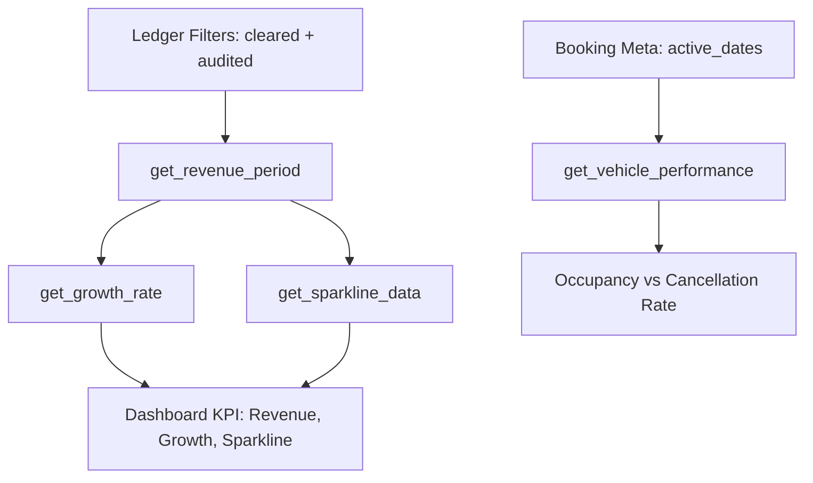

  

:::info Purpose
This page describes the logic and data sources behind the financial and operational metrics calculated by `AnalyticsService`.
:::

# 📊 Analytics and Financial Metrics

MHM Rentiva uses the `mhm_rentiva_ledger` table exclusively as the **Single Source of Truth** for financial metrics. Operational metrics (occupancy rate, etc.) are blended with booking metadata.

## 🛠️ Core Principles

- **Ledger-Only Truth:** Revenue calculations always come from the Ledger table, never from the Order table.
- **UTC Normalization:** All time windows are normalized to UTC and use non-overlapping periods.
- **Sanitization:** Metric queries always include `status = 'cleared'` and `type IN ('commission_credit', 'commission_refund')` filters.

---

## 📈 Financial Metrics

Key financial indicators calculated by the system:

| Metric | Method | Calculation Logic |
| :--- | :--- | :--- |
| **Net Revenue** | `get_revenue_period()` | `Sum(commission_credit) - Sum(commission_refund)` |
| **Growth Rate** | `get_growth_rate()` | `((Current - Previous) / Previous) * 100` |
| **Avg. Booking** | `get_avg_booking_value()` | `Total_Net / Unique_Booking_Count` |
| **Sparkline** | `get_sparkline_data()` | Balance points normalized on a daily basis. |

---

## ⚙️ Operational Metrics

Metrics used for Vehicle- and Vendor-based performance analysis:

### 1. Occupancy Rate
Calculated via the `get_vehicle_performance()` method. The ratio of days the vehicle was booked (completed, confirmed, in_progress) to the total number of days in the specified time window.

### 2. Cancellation Rate
The percentage of `cancelled` and `refunded` records within total bookings.

---

## 🔄 Metric Calculation Flow

---

## 🛡️ Critical Details

- **NULL vs 0.0:** In `get_growth_rate()`, if the previous period has zero data, the result returns `NULL`. This distinguishes "no change" (0.0) from "insufficient data" (NULL) in financial reporting.
- **Sparkline Backfilling:** For days with no activity, the system automatically inserts `0.0` so charts have no gaps.
- **Banker-Safe Rounding:** `PHP_ROUND_HALF_UP` is used for all percentage calculations to maintain financial precision.

## Section Summary
- Financial metrics rely solely on the **Ledger** table.
- Operational metrics are protected by time-window (Window Intersection) guards.
- All data is produced UTC-based and consistently (idempotent).

## Changelog
| Date | Version | Note |
|---|---|---|
| 23.04.2026 | 4.27.2 | English translation added. |
| 19.03.2026 | 4.21.2 | Page updated to reflect AnalyticsService's Ledger and Operational metric structure. |
