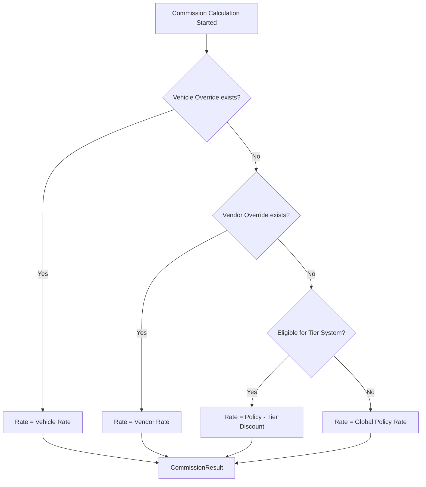

  

:::info Purpose
This page documents how commission rates are determined, how versioned policies (`PolicyService`) work, and how performance incentives (`TierService`) operate.
:::

# 🏷️ Commission and Policy System

MHM Rentiva uses a multi-layered, deterministic **Commission Resolution Hierarchy** to calculate commission rates. The system supports both global rules and custom commercial agreements (Overrides).

## 📉 Resolution Hierarchy

`CommissionResolver` determines which rate applies to a booking through a 4-level check, from most specific to most general:

| Priority | Level | Meta / Source | Description |
| :--- | :--- | :--- | :--- |
| **1** | **Vehicle Override** | `_mhm_vendor_commission_rate` | If a specific rate is assigned to the vehicle itself, it takes highest priority. |
| **2** | **Vendor Override** | `_mhm_vendor_commission_rate` | If a specific rate is assigned to the vendor user (and no Vehicle override exists), it applies. |
| **3** | **Tier Incentive** | `TierService` | An additional discount is applied on top of the Global rate based on the vendor's performance over the last 30 days. |
| **4** | **Global Policy** | `CommissionPolicy` | If no other rule matches, the system's default policy rate is applied. |

---

## 🌳 Commission Resolution Decision Tree

---

## 📜 Policy Versioning and Auditing

Every commission rate in the system is bound to a **Policy** object (`MHMRentiva\Core\Financial\CommissionPolicy`).

- **Immutable Hash:** A unique `version_hash` is generated on each policy change.
- **Audit Consistency:** When a Ledger entry is created, the current `policy_id` and `version_hash` are stamped onto the record. This proves why a particular rate was used even 2 years later.
- **Time-based Resolution:** The `PolicyService::resolve_policy_at()` method finds the policy that was active at the time the booking was created. Retroactive updates do not break old records.

---

## 💎 Tier and Incentive System

`TierService` is designed to reward vendors with high sales volume:
- **Net Revenue Check:** Calculated from the "Cleared" balance over the last 30 days.
- **Additive Discount:** The Tier discount applies only on top of the **Global Policy**. Vendors with a custom agreement (Override) cannot additionally benefit from the Tier discount.

## Section Summary
- Resolution order: **Vehicle > Vendor > Tier > Global**.
- All decisions are based on **deterministic** and **versioned** policies.
- A policy snapshot is captured with every calculation for financial auditing.

## Changelog
| Date | Version | Note |
|---|---|---|
| 23.04.2026 | 4.27.2 | English translation added. |
| 19.03.2026 | 4.21.2 | Page updated with 4-level hierarchy and Tier discount logic. |
