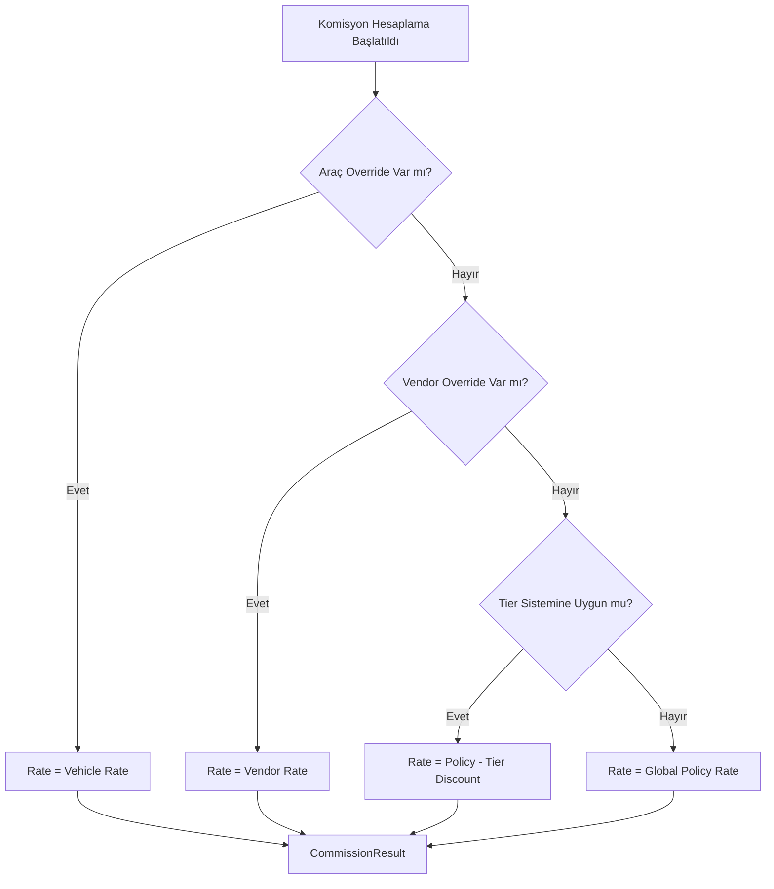

  

:::info Amaç
Bu sayfa, komisyon oranlarının nasıl belirlendiğini, versiyonlanmış politikaların (`PolicyService`) ve performans teşviklerinin (`TierService`) nasıl çalıştığını dökümante eder.
:::

# 🏷️ Komisyon ve Policy Sistemi

MHM Rentiva, komisyon oranlarını hesaplamak için çok katmanlı ve deterministik bir **Komisyon Çözümleme Hiyerarşisi** kullanır. Bu sistem, hem global kuralları hem de özel ticari anlaşmaları (Overrides) destekler.

## 📉 Karar Hiyerarşisi (Resolution Hierarchy)

`CommissionResolver`, bir rezervasyon için hangi oranın geçerli olacağına en özelden (Specific) en genele (Global) doğru 4 seviyeli bir kontrol ile karar verir:

| Öncelik | Seviye | Meta / Kaynak | Açıklama |
| :--- | :--- | :--- | :--- |
| **1** | **Vehicle Override** | `_mhm_vendor_commission_rate` | Aracın kendisine özel bir oran atanmışsa en yüksek önceliğe sahiptir. |
| **2** | **Vendor Override** | `_mhm_vendor_commission_rate` | Satıcı kullanıcısına özel bir oran atanmışsa (Vehicle yoksa) geçerlidir. |
| **3** | **Tier Incentive** | `TierService` | Satıcının son 30 günlük başarısına göre Global orana ek indirim uygulanır. |
| **4** | **Global Policy** | `CommissionPolicy` | Hiçbir kural eşleşmezse sistemin varsayılan politika oranı uygulanır. |

---

## 🌳 Komisyon Çözümleme Karar Ağacı

---

## 📜 Policy Versiyonlama ve Denetim

Sistemde her komisyon oranı bir **Policy** nesnesine (`MHMRentiva\Core\Financial\CommissionPolicy`) bağlıdır.

- **Immutable Hash:** Her politika değişikliğinde benzersiz bir `version_hash` üretilir.
- **Audit Consistency:** Ledger kaydı oluşturulurken o anki `policy_id` ve `version_hash` veriye damgalanır. Bu, 2 yıl sonra bile o kaydın neden o oranla hesaplandığını kanıtlar.
- **Time-based Resolution:** `PolicyService::resolve_policy_at()` metodu, rezervasyonun yaratıldığı tarihteki aktif olan politikayı bulur. Geriye dönük güncellemeler eski kayıtları bozmaz.

---

## 💎 Tier ve Teşvik Sistemi (Incentives)

`TierService`, yüksek hacimli satış yapan satıcıları ödüllendirmek için tasarlanmıştır:
- **Net Ciro Kontrolü:** Son 30 günlük "Cleared" bakiye üzerinden hesaplanır.
- **Additif İndirim:** Tier indirimi sadece **Global Policy** üzerinde uygulanır. Özel anlaşması (Override) olan satıcılar Tier indiriminden ayrıca yararlanamaz.

## Bölüm Sonu Özeti
- Karar sırası: **Vehicle > Vendor > Tier > Global**.
- Tüm kararlar **deterministik** ve **versiyonlanmış** politikalara dayanır.
- Finansal denetim için her hesaplamada politika snaphot'ı alınır.

## Değişiklik Günlüğü
| Tarih | Sürüm | Not |
|---|---|---|
| 19.03.2026 | 4.21.2 | Sayfa, 4 seviyeli hiyerarşi ve Tier indirim mantığıyla güncellendi. |
