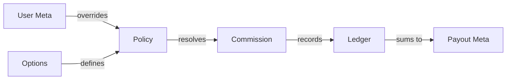

  

:::info Purpose
This page is the standard reference documentation for all keywords, database fields, and technical definitions used in the MHM Rentiva financial module.
:::

# 📖 Financial Data Dictionary

Financial data in the Rentiva ecosystem is stored across three main layers: **Global Settings (Options)**, **User Information (User Meta)**, and **Transaction Details (Payout/Booking Meta)**.

## ⚙️ Global Settings (Options)
System-wide financial configurations stored in the `wp_options` table:

| Key | Type | Description |
| :--- | :--- | :--- |
| `mhm_min_payout_amount` | `float` | Minimum balance a vendor must have to request a Payout. |
| `mhm_rentiva_global_payout_freeze` | `bool` | Emergency switch that halts all Payouts system-wide. |
| `mhm_rentiva_payout_webhook_secret`| `string` | HMAC-signed secret key used for Payout notifications. |
| `mhm_rentiva_commission_tiers` | `json` | Threshold values that determine discount rates based on sales volume. |

---

## 👤 Vendor Financial Data (User Meta)
Data stored per vendor in the `wp_usermeta` table:

| Key | Type | Description |
| :--- | :--- | :--- |
| `_mhm_vendor_commission_rate` | `float` | Fixed commission rate defined specifically for this vendor (Override). |
| `_mhm_vendor_payout_freeze` | `bool` | Block status that prevents only this vendor from receiving Payouts. |
| `_mhm_vendor_tier_id` | `string` | The performance tier the vendor currently belongs to. |

---

## 💰 Payout Data (Post Meta)
Metadata stored under the `mhm_rentiva_payout` post type:

| Key | Type | Description |
| :--- | :--- | :--- |
| `_mhm_payout_amount` | `float` | Net amount requested or paid. |
| `_mhm_payout_status` | `string` | Status: `pending`, `processing`, `completed`, `rejected`. |
| `_mhm_payout_external_ref` | `string` | Reference number from the bank or payment gateway (Stripe, etc.). |
| `_mhm_payout_rejection_reason` | `string` | Explanation text entered for rejected requests. |

---

## 🔑 Capabilities
WordPress capabilities required to manage financial operations:

- **`mhm_rentiva_approve_payout`**: Permission to approve Payout requests.
- **`mhm_rentiva_freeze_payout`**: Permission to freeze/block Payouts.
- **`mhm_rentiva_view_financial_audit`**: Permission to view audit logs and Ledger details.

---

## 🔄 Data Relationship Map

## Section Summary
- All financial keys are stored with the `_mhm_` prefix (private meta).
- Critical operations (e.g., `payout_status`) can only be changed by authorized (Capabilities) users.
- For fields in the Ledger table, see the [Ledger Model](./ledger-model) page.

## Changelog
| Date | Version | Note |
|---|---|---|
| 23.04.2026 | 4.27.2 | English translation added. |
| 19.03.2026 | 4.21.2 | Page updated to reflect the plugin's current Meta and Option keys. |
