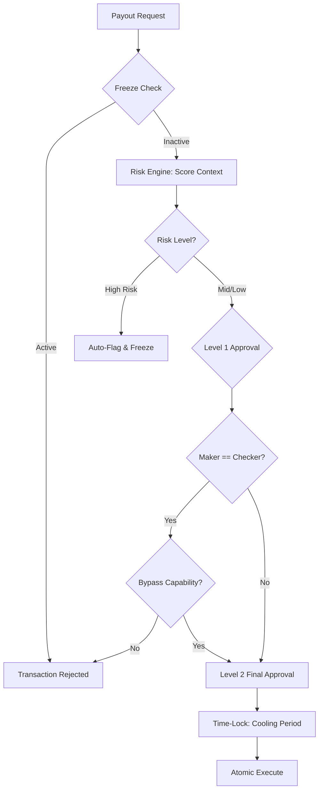

  

:::info Purpose
This page describes the risk analysis, approval hierarchy, and audit mechanisms in the financial Payout process.
:::

# ⚖️ Governance Controls

`GovernanceService` is an intelligent governance layer designed to ensure the correctness and security of financial transactions. Independent of the financial mechanics, it answers only the question: "Who can approve what, and at what risk?"

## 🛡️ Core Security Layers

### 1. Freeze Controls
Before any transaction is initiated, the system performs a two-stage freeze check:
- **Global Freeze:** If the `mhm_rentiva_global_payout_freeze` setting is active, all Payouts stop immediately.
- **Vendor Freeze:** Requests from vendors with the `_mhm_vendor_payout_freeze` meta are rejected.

### 2. Risk Engine (Deterministic Risk Analysis)
The system generates a risk score for each Payout request based on the following criteria:
- **Vendor Age:** Newer vendors receive a higher risk score.
- **Cancellation Rate:** Vendors with a high refund/cancellation rate are flagged for review.
- **Amount Limit:** Payouts above certain thresholds are automatically marked "High Risk".

### 3. Maker-Checker (Dual Approval Principle)
To prevent internal fraud, no administrator can unilaterally approve a Payout they initiated or created:
- **Maker:** The person who created the request or performed the initial review.
- **Checker:** A different authorized person who gives the final approval.
- *Exception:* Only senior administrators with the `mhm_rentiva_override_maker_checker` capability can bypass this rule (and the action is recorded in the forensic log).

---

## 🔄 Governance Workflow

---

## 🏛️ Audit Trail

All governance decisions are stored **immutably** in the `wp_mhm_rentiva_payout_audit` table:
- **IP Hash:** The IP trace of the actor is stored as SHA-256 to preserve privacy.
- **Action Constants:** Actions such as `submit_payout`, `review_payout`, `finalize_payout`, `bypass_time_lock` are recorded.
- **Metadata JSON:** The current risk score, workflow state, and contextual details are stamped on each event.

---

## ⏳ Time-Locks
Approved high-value Payouts are placed in the `STATE_TIME_LOCKED` phase. During this period, the funds are reserved but not immediately sent to the payment channel (Webhook). This "cooling period" is the last line of defense for rolling back erroneous or suspicious transactions.

## Section Summary
- Security hierarchy: **Freeze > Risk Engine > Maker-Checker > Time-Lock**.
- All decisions are permanently traceable in the **payout_audit** table.
- `GovernanceService` prevents process abuse, not financial errors.

## Changelog
| Date | Version | Note |
|---|---|---|
| 23.04.2026 | 4.27.2 | English translation added. |
| 19.03.2026 | 4.21.2 | Page updated to reflect GovernanceService's risk engine and Maker-Checker structure. |
