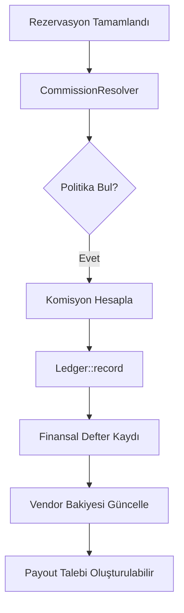

  

:::info Amaç
Bu sayfa, MHM Rentiva'nın finansal çekirdeğini (Financial Core), komisyon hesaplama mantığını ve veri güvenliği standartlarını özetler.
:::

# 💰 Finansal Sistem Genel Bakış

MHM Rentiva'nın kalbi olan finansal sistem, yüksek hassasiyetli hesaplamalar ve denetlenebilir (Auditable) bir veri yapısı üzerine kurulmuştur. Sistem, her işlemi **Immutable Ledger (Değiştirilemez Defter)** mantığıyla kayıt altına alır.

## 🏗️ Çekirdek Bileşenler

Finansal operasyonlar şu motorlar üzerinden yönetilir:

| Bileşen | Görev |
| :--- | :--- |
| `CommissionResolver` | Rezervasyon için en uygun komisyon politikasını belirleyen karar motoru. |
| `Ledger` | Tüm parasal hareketleri `wp_mhm_rentiva_ledger` tablosuna atomik olarak yazan servis. |
| `PayoutService` | Vendor hak edişlerini hesaplayan ve ödeme taleplerini yöneten katman. |
| `GovernanceService` | Finansal limitleri, risk kontrollerini ve yetkilendirmeleri denetler. |
| `PolicyRepository` | Versiyonlanmış komisyon politikalarını ve kurumsal anlaşmaları saklar. |

---

## 🔄 Finansal Veri Akışı

Bir rezervasyon tamamlandığında finansal sistem şu sırayla tetiklenir:

---

## 📉 Komisyon Çözümleme Hiyerarşisi (Decision Order)

Sistem, bir rezervasyon için hangi oranın uygulanacağına şu öncelik sırasına göre karar verir:

1.  **Araç Bazlı (Vehicle Override):** Araç ayarlarında özel bir komisyon oranı tanımlanmışsa o kullanılır.
2.  **Vendor Bazlı (Vendor Override):** Satıcıya özel bir anlaşma varsa uygulanır.
3.  **Tier Sistemi (Tier Discount):** Vendor'un performansına göre bir indirim/artış uygulanabilir.
4.  **Global Politika (Global Policy):** Hiçbir kural eşleşmezse sistemin genel ayarlarındaki varsayılan oran uygulanır.

---

## 🛡️ Finansal Güvenlik Prensipleri (Invariantlar)

- **Immutability:** `ledger` tablosundaki bir kayıt asla silinmez veya `UPDATE` edilmez. Yanlış işlemler "Ters Kayıt" (Offsetting Entry) ile düzeltilir.
- **Atomic Operations:** Komisyon hesaplama ve deftere yazma işlemi bir bütün (Atomic Transaction) olarak gerçekleşir.
- **Audit Trail:** Her finansal hareket, işlemi yapan kullanıcı ve zaman mührü (Timestamp) ile imzalanır.
- **Idempotency:** Aynı rezervasyon için mükerrer komisyon kaydı oluşması uygulama seviyesinde engellenmiştir.

## Bölüm Sonu Özeti
- Finansal sistem **Ledger-first** (Önce Defter) prensibiyle çalışır.
- Kararlar modüler `CommissionResolver` tarafından hiyerarşik olarak verilir.
- Tüm veriler mali denetime (Audit) uygun şekilde saklanır.

## Değişiklik Günlüğü
| Tarih | Sürüm | Not |
|---|---|---|
| 19.03.2026 | 4.21.2 | Finansal genel bakış, v1.9 hiyerarşisi ve Ledger mimarisine göre güncellendi. |

