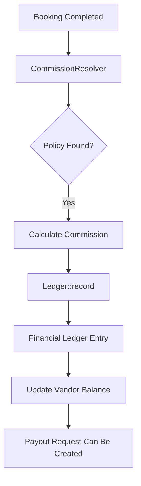

  

:::info Purpose
This page summarizes MHM Rentiva's Financial Core, commission calculation logic, and data security standards.
:::

# 💰 Financial System Overview

The financial system at the heart of MHM Rentiva is built on high-precision calculations and an auditable data structure. The system records every transaction using an **Immutable Ledger** approach.

## 🏗️ Core Components

Financial operations are managed through the following engines:

| Component | Responsibility |
| :--- | :--- |
| `CommissionResolver` | Decision engine that determines the most appropriate commission policy for a booking. |
| `Ledger` | Service that atomically writes all monetary movements to the `wp_mhm_rentiva_ledger` table. |
| `PayoutService` | Layer that calculates vendor earnings and manages Payout requests. |
| `GovernanceService` | Audits financial limits, risk controls, and authorizations. |
| `PolicyRepository` | Stores versioned commission policies and enterprise agreements. |

---

## 🔄 Financial Data Flow

When a booking is completed, the financial system is triggered in the following order:

---

## 📉 Commission Resolution Hierarchy (Decision Order)

The system determines which rate to apply to a booking based on the following priority order:

1.  **Vehicle-Based (Vehicle Override):** If a custom commission rate is defined in the vehicle settings, it is used.
2.  **Vendor-Based (Vendor Override):** If a custom agreement exists for the vendor, it is applied.
3.  **Tier System (Tier Discount):** A discount or increase may be applied based on the vendor's performance.
4.  **Global Policy (Global Policy):** If no rule matches, the default rate from the system's global settings is applied.

---

## 🛡️ Financial Security Principles (Invariants)

- **Immutability:** A record in the `ledger` table is never deleted or `UPDATE`d. Incorrect transactions are corrected via an "Offsetting Entry".
- **Atomic Operations:** Commission calculation and writing to the Ledger occur as a single unit (Atomic Transaction).
- **Audit Trail:** Every financial movement is signed with the acting user and a timestamp.
- **Idempotency:** Creating duplicate commission entries for the same booking is prevented at the application level.

## Section Summary
- The financial system operates on a **Ledger-first** principle.
- Decisions are made hierarchically by the modular `CommissionResolver`.
- All data is stored in compliance with financial auditing requirements.

## Changelog
| Date | Version | Note |
|---|---|---|
| 23.04.2026 | 4.27.2 | English translation added. |
| 19.03.2026 | 4.21.2 | Financial overview updated to reflect v1.9 hierarchy and Ledger architecture. |
