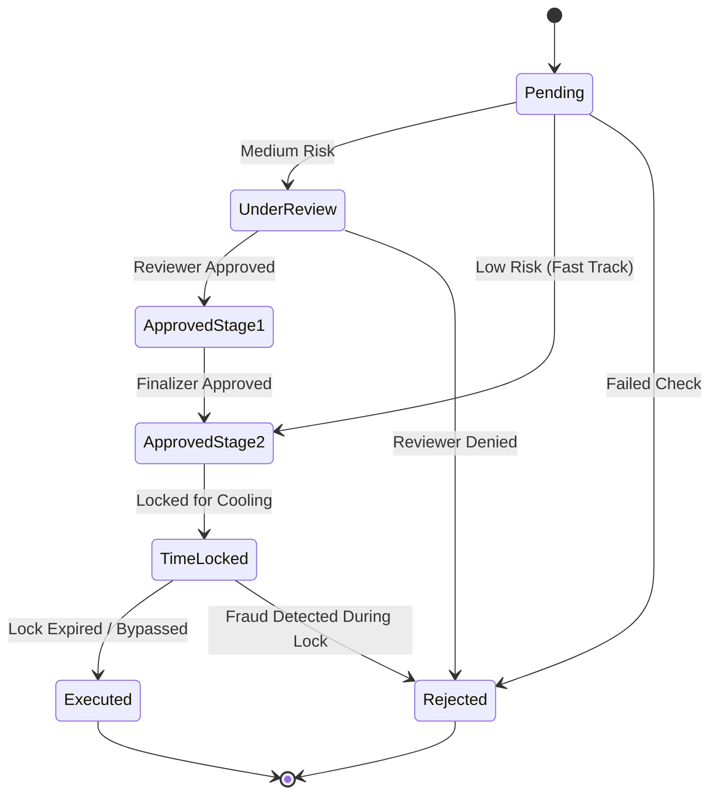

  

:::info Purpose
This page describes the workflow states, transition rules, and security barriers a Payout request passes through from creation to finalization.
:::

# 🔄 Payout Lifecycle

MHM Rentiva uses a strict **Approval State Machine** to manage Payout processes. Each transition is subject to both the system's risk score and human intervention (Maker-Checker).

---

## 🏗️ States

Every Payout request in the system exists in one of the following states:

| State | Code | Description |
| :--- | :--- | :--- |
| **Pending** | `pending` | Request just created, awaiting risk analysis. |
| **Under Review** | `under_review` | Manual review stage for medium-risk requests. |
| **Approved Stage 1** | `approved_stage_1` | First-level approval obtained (review complete). |
| **Approved Stage 2** | `approved_stage_2` | Final approval (Finalize) stage. |
| **Time Locked** | `time_locked` | Approved but waiting within the "Cooling Period". |
| **Executed** | `executed` | Payout successfully completed (Ledger closed). |
| **Rejected** | `rejected` | Request rejected, balance returned to the vendor. |

---

## 🌳 State Transition Diagram

---

## 🛡️ Transition Rules

### 1. Maker-Checker Segregation
The person who approves a Payout (`Checker`) cannot be the same person who initiated or prepared it (`Maker`). This rule is enforced at the code level (`ApprovalStateMachine::validate_transition`) to prevent internal misconduct.

### 2. Fast-Track
Requests with a **LOW** risk score can move directly from `Pending` to `Approved Stage 2`, bypassing `Under Review`. This is a convenience applied to trusted vendors to reduce operational overhead.

### 3. Atomic Updates
State transitions are executed **atomically** in the database. The `UPDATE ... WHERE current_state = old_state` query prevents two administrators from acting on the same Payout request simultaneously (Race Condition).

---

## ⏳ Time-Lock and Finalization
When `Approved Stage 2` is granted, the balance is atomically deducted from the Ledger as `payout_debit`, but the physical payment is not sent yet. The funds wait in `Time Locked` status. When the lock period expires, the system automatically moves the Payout to `Executed`.

## Section Summary
- State transitions are constrained by **a strict matrix**; arbitrary transitions are not possible.
- **Maker-Checker** is the system's fundamental security pillar.
- **Time-Lock** provides a "Rollback" opportunity for erroneous transactions.

## Changelog
| Date | Version | Note |
|---|---|---|
| 23.04.2026 | 4.27.2 | English translation added. |
| 19.03.2026 | 4.21.2 | Page updated with ApprovalStateMachine state matrix and Time-Lock logic. |
