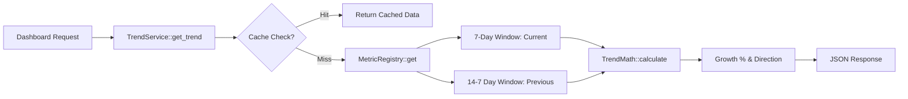

  

:::info Purpose
This page explains how growth rates, trend data, and periodic metrics displayed on the dashboard are calculated. `TrendService` acts as the system's "Analytics Intelligence".
:::

# 📈 TrendService and Metric Infrastructure

`TrendService` is a central engine that analyzes dynamic metrics (Bookings, Messages, Pickups, etc.) within specific time windows.

---

## 🏗️ Architecture

The system provides an extensible metric structure:
1.  **MetricRegistry:** Each metric (e.g., `total_bookings`) is registered in the system as a class containing its own calculation logic.
2.  **TrendService:** Uses registered metrics to compare "Last Week" vs "This Week".
3.  **TrendMath:** Converts comparison results into percentage (%) growth and direction (Up/Down) information.

---

## 🔄 Metric Calculation Flow

---

## ⏱️ Time Windows (Windowing)

`TrendService` uses two **7-day** windows for comparative analysis:
-   **Current Period:** Last 7 days (including today).
-   **Previous Period:** The 7 days before that (starting 14 days ago through 7 days ago).

This gives users data such as "X% growth/decline compared to last week".

---

## 📋 Available Metric Types

| Metric Key | Context | Description |
| :--- | :--- | :--- |
| `total_bookings` | `customer` | User's total and recent-period booking count. |
| `upcoming_pickups`| `customer` | Number of vehicle pickups in the next 7 days. |
| `unread_messages` | `customer` | Trend of unread messages received from vendors. |
| `net_revenue` | `vendor` | Vendor's earnings growth trend (Ledger-based). |

---

## ⚡ Performance and Caching

Metric calculations can generate `WP_Query` load on large databases. Thanks to `MetricCacheManager`:
-   Calculated trends are stored as transients for **1 hour**.
-   Cache keys are based on `context`, `metric`, and `subject_id` (User ID/Email).
-   When a new booking or message arrives, the relevant cache is automatically invalidated.

## Section Summary
-   Trends always operate on a **7-day comparison** basis.
-   New metric types can be added easily via `MetricRegistry`.
-   All data is served through a virtualized **Cache Layer**.

## Changelog
| Date | Version | Note |
|---|---|---|
| 23.04.2026 | 4.27.2 | English translation added. |
| 19.03.2026 | 4.21.2 | Page rewritten from scratch to reflect TrendService and MetricRegistry architecture. |
