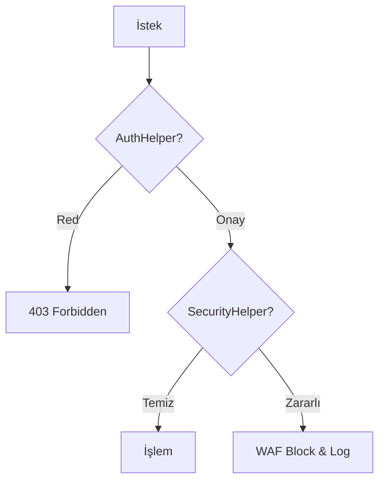

  

:::info Amaç
Bu rehber, Rentiva altyapısındaki verilerin korunması, GDPR/KVKK uyumluluğu ve olası güvenlik olaylarına müdahale süreçlerini kapsar.
:::

# 🔒 Güvenlik & Gizlilik Operasyonları

Rentiva, "Security by Design" prensibiyle veriyi toplama anından imha anına kadar sıkı denetim altında tutar.

---

## 🛡️ Güvenlik Katmanları ve Araçlar

### 🔑 Erişim Kontrolü (`AuthHelper`)
Tüm admin ve API erişimleri `AuthHelper::verify_request()` üzerinden geçer.
- **Capability Checks:** Operasyonel işlemler `manage_options` yerine özel `rentiva_financial_manager` yetkisiyle kısıtlanabilir.
- **API Key Rotation:** Sızma ihtimaline karşı API anahtarlarının 90 günde bir yenilenmesi önerilir.

### 🛡️ Girdi Güvenliği (`SecurityHelper`)
Veritabanına giren her veri `SecurityHelper::validate_*` metodlarından geçer:
- **XSS Koruması:** HTML içerikler `wp_kses` ile beyaz liste (Whitelist) süzgecine alınır.
- **SQLi Koruması:** Ham SQL yasaktır; tüm sorgular `$wpdb->prepare()` ile parametrize edilir.

---

## ⚖️ Veri Gizliliği (Privacy & GDPR)

### 🧹 Veri Anonimleştirme (Anonymization)
Kullanıcı hesabı silindiğinde veya yasal saklama süresi dolduğunda:
- `PrivacyManager::anonymize_user_data()` tetiklenerek isim, e-posta ve IP adresleri `deleted_u_{id}` şeklinde maskelenir.
- **Kural:** Finansal `Ledger` kayıtları anonimleştirilir ancak muhasebe bütünlüğü için silinmez.

### 📅 Veri Saklama Politikası
- **Web Logları:** 30 gün sonra otomatik temizlenir.
- **Audit Logları:** Yasal zorunluluk gereği 2 yıl boyunca salt-okunur (Read-only) saklanır.

---

## 🚨 Olay Müdahale Protokolü (Incident Response)

Bir veri ihlali veya anomali tespit edildiğinde:
1. **İzolasyon:** Etkilenen IP adresleri `RateLimiter` üzerinden global olarak engellenir.
2. **Snapshot:** Veritabanının o anki durumu adli inceleme (Forensic) için yedeklenir.
3. **Analiz:** `AdvancedLogger` kayıtları taranarak sızıntının kapsamı belirlenir.
4. **Bildirim:** Yasal süre içinde (GDPR için 72 saat) etkilenen kullanıcılara ve makamlara bilgi verilir.

---

## 🔄 Güvenlik Akış Şeması

## Bölüm Sonu Özeti
- Güvenlik operasyonları "En Az Yetki" (Least Privilege) prensibiyle yürütülür.
- `Ledger` verileri sistemin en mahrem kısmıdır; doğrudan müdahale yasaktır.
- Gizlilik ve güvenlik, sürekli izleme (Monitoring) ile garanti altına alınır.

## Değişiklik Günlüğü
| Tarih | Sürüm | Not |
|---|---|---|
| 19.03.2026 | 4.21.2 | Sayfa, SecurityHelper ve anonimleştirme protokolleriyle güncellendi. |
