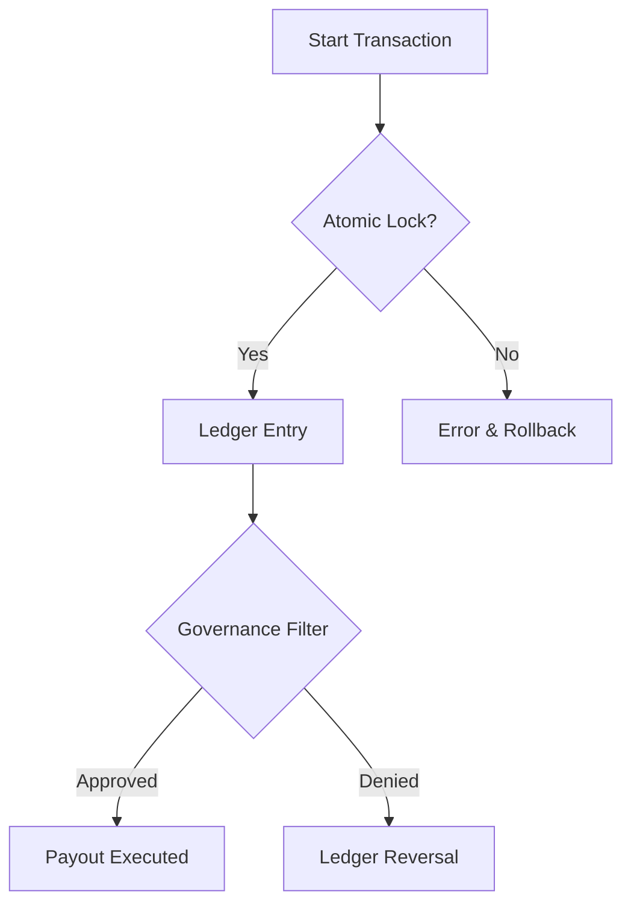

  

:::important Critical Warning
Tests in the financial layer must pass with 100% coverage. Any failure causes the entire payment system to lock.
:::

# 🛡️ Financial Test Strategy

The Rentiva Financial Layer uses a multi-layered test strategy to track money and prevent erroneous transactions. The core principles of this strategy are **Immutability** and **Atomicity**.

---

## 🏗️ Test Layers

### 1. Ledger Tests
`LedgerTest.php` verifies that ledger records can never be deleted or updated.
- **Rule:** Only `INSERT` operations are permitted.
- **Verification:** Negative balance checks and total balance consistency (checksum).

### 2. Atomicity and Regression (`AtomicPayoutServiceTest`)
Ensures the system remains consistent when a payment transaction is interrupted (race condition).
- **Test Scenario:** The transaction is fully rolled back when the database connection drops.
- **Idempotency:** The same payment request cannot be processed twice.

### 3. Tenant Isolation (`TenantIsolationTest`)
Verifies that transfer and payment data never mixes between different vendors (tenants).
- **Control:** Access by `vendor_a` to `vendor_b` ledger data is blocked.

---

## 🔒 Security Hardening Tests (Forensic Hardening)

`ForensicHardeningTest.php` audits data security to forensic standards:
- **Tampering Detection:** Detection of any unauthorized modifications to historical records.
- **Audit Consistency:** Whether governance decisions match the forensic logs.

---

## 🧪 Governance and Freeze Tests

The `GovernanceFreezeTest.php` and `GovernanceAuthorizationTest.php` classes verify:
- **Freeze:** Immediate blocking of payment requests from a high-risk vendor.
- **Authorization:** That the Maker-Checker principle (inability to self-approve) has not been violated.

---

## 🔄 Test Flow Diagram

## Section Summary
- All financial tests are located in the `tests/Core/Financial` directory.
- **Forensic Hardening** preserves the forensic evidence value of the system.
- Regression tests run automatically before each release.

## Changelog
| Date | Version | Note |
|---|---|---|
| 23.04.2026 | 4.27.2 | English translation added. |
| 19.03.2026 | 4.21.2 | Page updated per Forensic Hardening and Tenant Isolation tests. |
