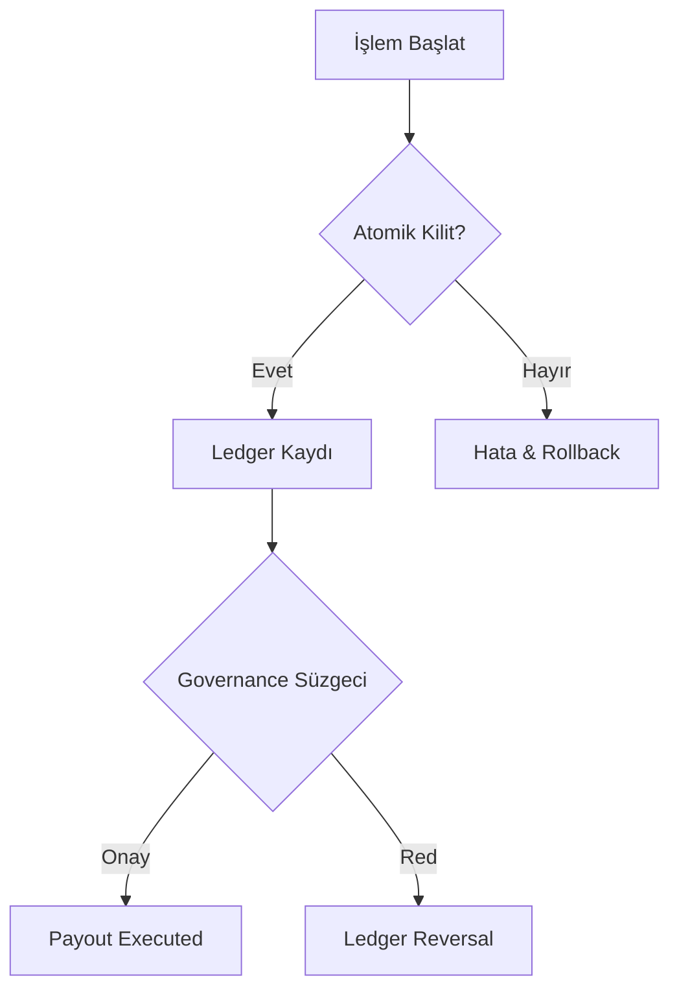

  

:::important Kritik Uyarı
Finansal katmandaki testlerin %100 kapsama (Coverage) ile geçmesi zorunludur. Herhangi bir başarısızlık, tüm ödeme sisteminin kilitlenmesine neden olur.
:::

# 🛡️ Finansal Test Stratejisi

Rentiva Finansal Katmanı, paranın izini sürmek ve hatalı işlemleri önlemek için çok katmanlı bir test stratejisi kullanır. Bu stratejinin merkezinde **Değişmezlik (Immutability)** ve **Atomiklik (Atomicity)** prensipleri yer alır.

---

## 🏗️ Test Katmanları

### 1. Ledger (Defter) Testleri
`LedgerTest.php`, defter kayıtlarının asla silinemeyeceğini ve güncellenemeyeceğini doğrular.
- **Kural:** Sadece `INSERT` işlemine izin verilir.
- **Doğrulama:** Negatif bakiye kontrolleri ve toplam bakiye tutarlılığı (Checksum).

### 2. Atomiklik ve Regresyon (`AtomicPayoutServiceTest`)
Ödeme işlemlerinin yarıda kalması (Race Condition) durumunda sistemin tutarlı kalmasını sağlar.
- **Test Senaryosu:** Veritabanı bağlantısı koptuğunda işlemin tamamen geri alınması (Rollback).
- **Idempotency:** Aynı ödeme talebinin iki kez işlenmesinin engellenmesi.

### 3. Kiracı İzolasyonu (`TenantIsolationTest`)
Transfer ve ödeme verilerinin farklı satıcılar (Tenants) arasında asla karışmadığını doğrular.
- **Kontrol:** `vendor_a` kullanıcısının `vendor_b` ledger verisine erişimi engellenir.

---

## 🔒 Güvenlik Sertleştirme Testleri (Forensic Hardening)

`ForensicHardeningTest.php`, adli bilişim standartlarında veri güvenliğini denetler:
- **Tampering Detection:** Geçmiş kayıtlarda yasadışı değişiklik yapılıp yapılmadığının tespiti.
- **Audit Consistency:** Governance kararlarının adli loglarla uyuşup uyuşmadığı.

---

## 🧪 Governance ve Dondurma Testleri

`GovernanceFreezeTest.php` ve `GovernanceAuthorizationTest.php` sınıfları şunları denetler:
- **Dondurma (Freeze):** Riskli bir satıcının ödeme taleplerinin anında bloke edilmesi.
- **Yetkilendirme:** Maker-Checker prensibinin (kendine onay verememe) ihlal edilmediği.

---

## 🔄 Test Akış Şeması

## Bölüm Sonu Özeti
- Tüm finansal testler `tests/Core/Financial` dizininde yer alır.
- **Forensic Hardening**, sistemin adli kanıt değerini korur.
- Regresyon testleri, her sürüm öncesi otomatik olarak çalıştırılır.

## Değişiklik Günlüğü
| Tarih | Sürüm | Not |
|---|---|---|
| 19.03.2026 | 4.21.2 | Sayfa, Forensic Hardening ve Tenant Isolation testlerine göre güncellendi. |

