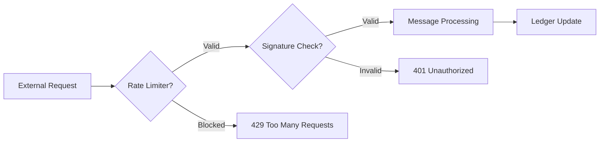

  

:::info Purpose
This page documents the test processes for Rentiva's asynchronously operating transfer module and the externally exposed webhook endpoints.
:::

# 🛰️ Transfer & Webhook Test Model

The transfer and webhook layers are the most critical endpoints through which the system communicates with the outside world. For this reason, test scenarios are built on the "Safe Reject" principle.

---

## 🛣️ Transfer and Location Tests

Tests run via `HybridLocationTest.php` verify the logic for location-based search and route calculation:
- **Hybrid Data Logic:** Verifies that locations are retrieved consistently from both metadata and custom tables.
- **Route Integrity:** Tests whether the system produces the correct "Fallback" (error message or alternative route) for undefined routes.
- **Async Search:** Runs performance and accuracy tests on location-based search queries from the frontend.

---

## 🛡️ Webhook Security and Rate Limiting

Notifications arriving from external sources (Bank, Payment Provider, etc.) pass through strict scrutiny with `WebhookRateLimiterTest.php`:
- **Rate Limiting:** Immediate blocking of abnormal traffic spikes (DDoS or brute-force attempts) from the same IP or source.
- **Payload Validation:** Signature (HMAC) verification and JSON schema validation of incoming data.
- **Idempotency:** Prevention of double-processing for the same webhook notification.

---

## ⚠️ Negative Scenarios (Edge Cases)

The following situations are always tested to measure system resilience:
- **Cross-Line Conflict:** Attempting to book a vehicle on two different transfer routes simultaneously.
- **Invalid Webhook Signature:** Requests with incorrect or expired signatures must return `401 Unauthorized`.
- **Missing Parameter:** Handling of requests made with missing coordinate or city data during route calculation.

---

## 📊 Test Flow Diagram (Webhook)

## Section Summary
- Webhook tests place security at the center.
- Transfer tests validate the "Hybrid Location" architecture.
- Both modules undergo resilience tests against async errors (timeout, race condition).

## Changelog
| Date | Version | Note |
|---|---|---|
| 23.04.2026 | 4.27.2 | English translation added. |
| 19.03.2026 | 4.21.2 | Page updated per HybridLocationTest and WebhookRateLimiterTest standards. |
