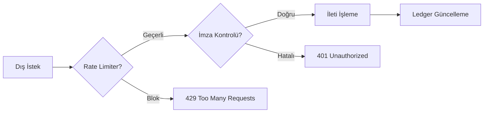

  

:::info Amaç
Bu sayfa, Rentiva'nın asenkron çalışan transfer modülü ve dış dünyaya açık Webhook uç noktalarının (Endpoint) test süreçlerini dökümante eder.
:::

# 🛰️ Transfer & Webhook Test Modeli

Transfer ve Webhook katmanları, sistemin dış dünya ile konuştuğu en kritik uç noktalarıdır. Bu nedenle test senaryoları "Güvenli Red" (Safe Reject) prensibi üzerine kuruludur.

---

## 🛣️ Transfer ve Lokasyon Testleri

`HybridLocationTest.php` üzerinden yürüten testler, lokasyon bazlı arama ve rota hesaplama mantığını doğrular:
- **Hybrid Data Logic:** Lokasyonların hem meta veriden hem de özel tablolardan tutarlı geldiği denetlenir.
- **Route Integrity:** Tanımlanmamış rotalar için sistemin doğru "Fallback" (Hata mesajı veya alternatif rota) üretip üretmediği test edilir.
- **Asenkron Arama:** Frontend üzerindeki lokasyon bazlı arama sorgularının performans ve doğruluk testleri yapılır.

---

## 🛡️ Webhook Güvenliği ve Hız Sınırı

Dışarıdan (Banka, Ödeme Sağlayıcı vb.) gelen bildirimler `WebhookRateLimiterTest.php` ile sıkı bir denetimden geçer:
- **Rate Limiting:** Aynı IP veya kaynaktan gelen anormal trafik artışlarının (DDoS veya Brute Force denemeleri) anında bloklanması.
- **Payload Validation:** Gelen verinin imza (Signature) doğrulaması ve JSON şema kontrolü.
- **Idempotency:** Aynı Webhook bildiriminin iki kez işlenmesinin (Double-processing) engellenmesi.

---

## ⚠️ Negatif Senaryolar (Edge Cases)

Sistemin dayanıklılığını ölçmek için şu durumlar her zaman test edilir:
- **Hatlar Arası Çakışma:** Bir aracın aynı anda iki farklı transfer rotasında rezerve edilmeye çalışılması.
- **Geçersiz Webhook İmzası:** Hatalı veya süresi geçmiş imzalarla gelen isteklerin `401 Unauthorized` dönmesi.
- **Eksik Parametre:** Rota hesaplanırken eksik koordinat veya şehir verisiyle yapılan isteklerin yönetimi.

---

## 📊 Test Akış Şeması (Webhook)

## Bölüm Sonu Özeti
- Webhook testleri güvenliği merkeze alır.
- Transfer testleri "Hybrid Location" mimarisini doğrular.
- Her iki modül de asenkron hatalara karşı (Timeout, Race Condition) dayanıklılık testlerinden geçer.

## Değişiklik Günlüğü
| Tarih | Sürüm | Not |
|---|---|---|
| 19.03.2026 | 4.21.2 | Sayfa, HybridLocationTest ve WebhookRateLimiterTest standartlarına göre güncellendi. |
