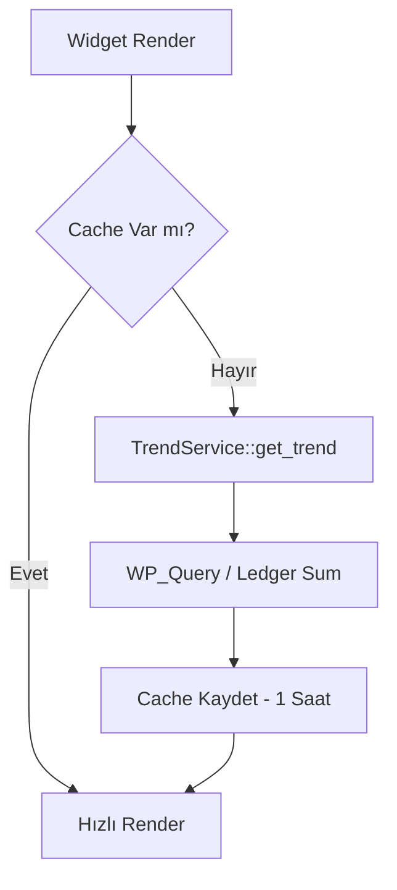

  

:::info Amaç
Bu sayfa, hem WordPress yönetim panelinde (Admin) hem de ön yüz (Frontend) kullanıcı panellerinde kullanılan KPI kartlarının, widget'ların ve analitik bileşenlerin mimarisini açıklar.
:::

# 📊 Dashboard Widget Mimarisi

Rentiva dökümantasyonunda "Widget", veriyi görselleştiren ve etkileşim sunan bağımsız UI bloklarını ifade eder. Bu bloklar iki ana katmanda çalışır: **Frontend (Elementor)** ve **Admin (Custom List Tables)**.

---

## 🎨 1. Frontend Widget Katmanı (Elementor)

Ön yüz panellerindeki (Müşteri/Satıcı) tüm görsel bileşenler `ElementorIntegration` sınıfı üzerinden yönetilir. 

### Temel KPI Widget'ları
Tüm KPI kartları verisini `TrendService` üzerinden asenkron olarak çeker:
- **My Bookings Widget:** Aktif rezervasyon sayılarını ve büyüme trendini gösterir.
- **Payment History Widget:** Satıcının hakediş ve ödeme geçmişini tablo olarak sunar.
- **My Messages Widget:** Okunmamış mesaj sayısını anlık (Real-time) yansıtır.

---

## ⚙️ 2. Admin Widget Katmanı (List Tables)

Yönetim panelindeki finansal veriler, `WP_List_Table` tabanlı özelleştirilmiş bileşenlerle sunulur.

### Payout List Table (`PayoutListTable.php`)
Finansal operasyonların kalbi olan bu tablo şunları içerir:
- **Analitik Kolonlar:** Mevcut Bakiye, Talep Edilen Tutar ve İşlem Durumu.
- **Toplu İşlemler (Bulk Actions):** Onay Bekleyen (Pending) ödemelerin tek tıkla toplu onaylanması.
- **Banka Uyumluluğu:** İşlem durumlarını (Confirmed / Failed) Processor katmanından gelen verilerle anlık günceller.

---

## 🔄 Veri Akışı ve Performans

Widget'lar, veritabanı yükünü minimize etmek için **Tier-1 Cache** katmanı kullanır:

---

## 🛡️ Güvenlik Kuralları

- **Data Isolation:** Bir satıcı sadece kendi verisini (`post_author` eşleşmesi) görebilir.
- **Capability Check:** `PayoutListTable` üzerindeki toplu onay butonu sadece `mhm_rentiva_approve_payout` yetkisine sahip kullanıcılara görünür.
- **Nonce Security:** Elementor widget'ları üzerinden yapılan tüm AJAX istekleri `mhm_rentiva_elementor` nonce anahtarıyla doğrulanır.

## Bölüm Sonu Özeti
- Frontend widget'ları **Elementor** tabanlıdır ve `TrendService` kullanır.
- Admin widget'ları **WP_List_Table** sınıfını extend eder.
- Tüm widget'lar yüksek performans için **Caching** mekanizmasına tabidir.

## Değişiklik Günlüğü
| Tarih | Sürüm | Not |
|---|---|---|
| 19.03.2026 | 4.21.2 | Sayfa, Elementor entegrasyonu ve TrendService KPI yapısına göre güncellendi. |

