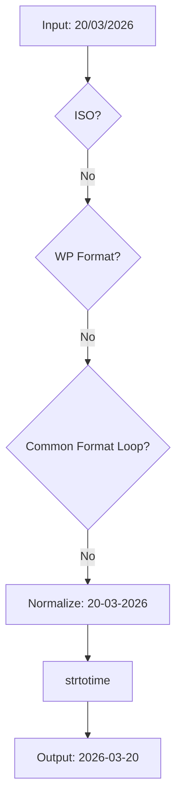

  

:::info Purpose
This document explains the operating principles of the `SecurityHelper::validate_date` method and the date normalization standards used across the Rentiva ecosystem.
:::

# 📅 Date Validation and Normalization

Dates in Rentiva can arrive in various formats (UI, API, DatePicker). The `SecurityHelper::validate_date` method acts as a "Secure Gate" that converts all these inputs into the standard **ISO (YYYY-MM-DD)** format.

---

## 🛠️ Validation Hierarchy

The method attempts to normalize incoming data in the following order:

1.  **ISO Check:** If the value is already in `YYYY-MM-DD` format, it is returned directly.
2.  **WP Date Format:** Attempts to parse using the `date_format` value from WordPress settings (e.g. `d/m/Y`).
3.  **Common Formats:** Iterates through `d/m/Y`, `m/d/Y`, `d-m-Y`, `Y/m/d` in a loop.
4.  **Normalization & Fallback:** Converts separators (`.`, `/`, ` `) to `-` and makes a final attempt with `strtotime`.

---

## 🔄 Flow Diagram



---

## 💻 Usage Example

```php
use MHMRentiva\Admin\Core\SecurityHelper;

try {
    // Validation with different formats
    $date1 = SecurityHelper::validate_date('2026-01-01'); // Returns '2026-01-01'
    $date2 = SecurityHelper::validate_date('31/12/2025'); // Returns '2025-12-31'
    $date3 = SecurityHelper::validate_date('2025.05.20'); // Returns '2025-05-20'
} catch (\InvalidArgumentException $e) {
    // Invalid format handling
    AdvancedLogger::error('Invalid date attempt: ' . $e->getMessage());
}
```

---

## 🛡️ Security and Error Handling

-   **Strict Validation:** If no format matches, the method throws an `InvalidArgumentException`.
-   **Null Safety:** If the input is empty or null, it is cleaned via `sanitize_text_field_safe` and an exception is thrown.
-   **Timezone:** The final output is always produced as UTC-based via `gmdate('Y-m-d')`.

## Section Summary
-   All date inputs must pass through the `validate_date` filter.
-   The output is always a string in **ISO (YYYY-MM-DD)** format.
-   On failure, an `Exception` is thrown that interrupts the application flow.

## Changelog
| Date | Version | Note |
|---|---|---|
| 23.04.2026 | 4.27.2 | English translation added. |
| 19.03.2026 | 4.21.2 | Updated to reflect SecurityHelper::validate_date normalization and fallback logic. |
