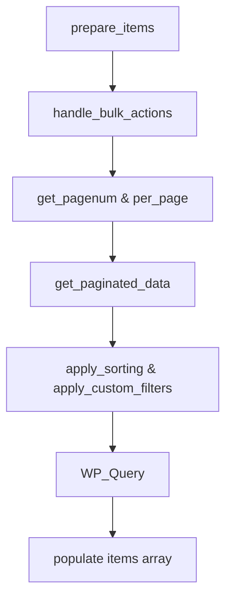

  

:::info Purpose
This page describes the `AbstractListTable` class — the foundation of all tables in the Rentiva admin panel — and the data listing standards it enforces.
:::

# 📋 List Table Standards

Rentiva uses an **Abstract** layer that modernizes WordPress's built-in `WP_List_Table` class and eliminates code duplication.

---

## 🏗️ AbstractListTable Architecture

`AbstractListTable` centrally manages the common needs of all sub-tables (Payments, Customers, Messages, etc.):
- **Automatic Pagination:** Limit and offset management via `set_pagination_args`.
- **Sorting:** Automatic application of column-based ASC/DESC logic.
- **Search:** Global search integration via the `s` parameter.
- **Security (Nonce):** Automatic nonce verification for bulk actions.

---

## 🛠️ Creating a List Table

To add a new table to the system, extend the `AbstractListTable` class and implement the following methods:

| Method | Responsibility |
| :--- | :--- |
| `get_singular_name()` | Singular name (e.g. `payout`). |
| `get_plural_name()` | Plural name (e.g. `payouts`). |
| `get_data_query_args()` | Data retrieval arguments (`WP_Query` compatible). |
| `get_total_count()` | Total record count (for pagination). |
| `process_bulk_action()` | Bulk action logic (Approve, Delete, etc.). |

---

## 🔄 Data Preparation Flow

---

## 🧩 Built-in Helper Methods

Sub-classes can use built-in methods instead of complex HTML structures:
- **`render_status_badge()`:** Converts status codes into colored badges.
- **`format_price()`:** Formats currency and thousands separators.
- **`render_row_actions()`:** Generates quick action links such as Edit/Delete.
- **`create_view_link()`:** Provides a secure link to an item's detail page.

## 🛡️ Security Protocol

- **Nonce Enforcement:** All bulk actions are verified via `mhm_listtable_nonce`.
- **Redirects:** `wp_safe_redirect` is used after bulk actions to prevent "Form Resubmission" errors.
- **Sanitization:** All filter parameters coming into the table are passed through `sanitize_text_field_safe`.

## Section Summary
- New tables must always use the `AbstractListTable` class.
- Data retrieval logic must be encapsulated in `get_data_query_args`.
- `safe_output` or WordPress escaping functions are required at all output layers.

## Changelog
| Date | Version | Note |
|---|---|---|
| 23.04.2026 | 4.27.2 | English translation added. |
| 19.03.2026 | 4.21.2 | Page rewritten from scratch to reflect AbstractListTable central architecture. |
