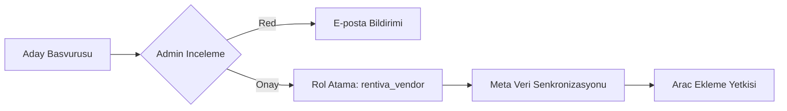

  

:::info Amaç
Rentiva, merkezi bir araç kiralama sisteminden çoklu tedarikçili (Multi-Vendor) bir pazar yerine dönüşebilir. Bu doküman, tedarikçi döngüsünü teknik detaylarıyla açıklar.
:::

# 🤝 Tedarikçi Yönetimi

Sistemde bir kullanıcının "Vendor" (Tedarikçi) olması için geçmesi gereken aşamalar ve bu sürecin arkasındaki teknik yapılar aşağıda özetlenmiştir.

---

## 🏗️ 1. Tedarikçi Rolü ve Yetkilendirme

### `rentiva_vendor` Rolü
Onaylı her tedarikçiye atanan bu rol, şu yetkileri (capabilities) beraberinde getirir:
- `edit_posts`: Kendi araçlarını ekleyebilir.
- `upload_files`: Araç görselleri yükleyebilir.
- `read`: Vendor paneline erişebilir.

### 🛡️ Mülkiyet Zorunluluğu (`VendorOwnershipEnforcer`)
Tedarikçilerin birbirlerinin araçlarına veya rezervasyonlarına erişmesini engellemek için `user_has_cap` filtresi kullanılır:
- Bir vendor sadece `post_author` değeri kendi `user_id`'si ile eşleşen `vehicle` kayıtlarını düzenleyebilir.
- Admin portalında "All Vehicles" listesi vendor için sadece kendi kayıtlarına filtrelenir.

---

## 📋 2. Başvuru Yönetimi (`mhm_vendor_app`)

Tedarikçi adaylarının verileri `mhm_vendor_app` Custom Post Type (CPT) içinde saklanır:
- **Onboarding Akışı:** `Pending` (İnceleme) → `Approved` (Onaylandı) / `Rejected` (Reddedildi).
- **Veri Güvenliği:** Başvuru sırasında alınan IBAN bilgileri `VendorApplicationManager::encrypt_iban()` ile **AES-256-CBC** metoduna göre şifrelenir.
- **Evrak Takibi:** Kimlik, ehliyet ve ikametgah belgeleri `_vendor_doc_*` meta anahtarları altında WordPress Media Library ile ilişkilendirilir.

---

## ⚙️ 3. Operasyonel Kontroller

### Onay ve Meta Senkronizasyonu (`VendorOnboardingController`)
Admin bir başvuruyu onayladığında:
1. `mhm_vendor_app` kaydındaki telefon, şehir ve IBAN bilgileri kullanıcının (WP_User) meta tablolarına kopyalanır.
2. Kullanıcının rolü `customer`'dan `rentiva_vendor`'a yükseltilir.
3. `mhm_rentiva_vendor_approved` kancası (hook) tetiklenerek hoş geldin e-postası gönderilir.

### Profil Yonetimi (`VendorProfileExtension`)
WordPress profil sayfasi (`wp-admin/profile.php`), vendorlara ozel alanlarla genisletilmistir:
- **Magaza Bilgileri:** Bio, vergi numarasi ve hizmet bolgeleri.
- **Finansal Bilgiler:** Maskelenmis IBAN gorunumu (orn: TR***5678).

### Vendor Ayarlar Sayfasi (v4.23.1)

Vendor panelindeki ayarlar sayfasi (`vendor-settings.php`) v4.23.1 ile tamamen yeniden tasarlandi:

- **CSS Mimarisi:** Tum inline stiller kaldirildi, `.mhm-vendor-form__*` CSS sinif yapisi ile `vendor-forms.css` dosyasina tasindi.
- **Yeni Alanlar:** Hesap Sahibi (Account Holder) ve Vergi Dairesi (Tax Office) alanlari eklendi.
- **Sehir Secimi:** Metin girisi yerine SelectWoo bileseni (`CityHelper::render_select()`) kullanilir.
- **Bildirim Sistemi:** Basari/hata bildirimleri `mhm-vendor-notice` sinif yapisi ile standartlastirildi.

:::tip Teknik Not
Vendor ayarlar sayfasindaki tum form alanlari `.mhm-vendor-form__group`, `.mhm-vendor-form__label`, `.mhm-vendor-form__input` gibi BEM-benzeri siniflarla stillendirilir. Yeni alan eklemek icin ayni sinif yapisini takip edin.
:::

---

## Yasam Dongusu Ozeti

---

## 🚐 5. Vendor Transfer Lokasyon ve Rota Yönetimi (v4.23.0)

v4.23.0 ile birlikte vendor'lar, transfer hizmetleri için lokasyon ve rota seçimi yapabilir:

### Şehir Bazlı Filtreleme
Vendor araç ekleme formunda (`[rentiva_vehicle_submit]`), yalnızca vendor'un başvurusunda belirttiği **şehirdeki lokasyonlar** ve **rotalar** listelenir. Bu, **Şehir → Nokta** hiyerarşisinin bir parçasıdır.

### Rota Bazlı Fiyatlandırma
- Vendor, hizmet vermek istediği rotaları seçer.
- Her rota için admin'in belirlediği `min_price` — `max_price` aralığında kendi fiyatını girer.
- Kapasite bilgileri (yolcu, bagaj) araç düzeyinde tanımlanır.

### Meta Yapısı
- `_mhm_rentiva_transfer_locations`: Vendor'un hizmet verdiği lokasyonlar (array)
- `_mhm_rentiva_transfer_routes`: Vendor'un hizmet verdiği rotalar (array)
- `_mhm_rentiva_transfer_route_prices`: Rota bazlı vendor fiyatları (JSON)

### Admin Görünümü
Admin araç düzenleme ekranında (`VehicleTransferMetaBox`), vendor'un şehir bilgisi ve seçtiği lokasyon/rotalar görüntülenir.

---

## Arac Yasam Dongusu Yonetimi (Tasarim — v4.23.1)

v4.23.1 ile kapsamli bir tasarim dokumani hazirlanmistir (`docs/plans/2026-03-28-vehicle-lifecycle-management-design.md`). Planladigi yapilar:

| Ozellik | Detay |
|---------|-------|
| **Durumlar** | Aktif / Duraklatildi / Geri Cekildi / Suresi Doldu |
| **Listeleme suresi** | 90 gun, vendor tarafindan yenilenebilir |
| **Iptal ceza sistemi** | Kademeli ceza puanlari |
| **Guvenilirlik skoru** | 0-100 arasi performans degerlendirmesi |
| **Soguma suresi** | Geri cekilmeden sonra 7 gun bekleme |
| **Anti-gaming** | Tarih engelleme sistemi |

:::caution Henuz Uygulanmadi
Bu ozellik su anda tasarim asamasindadir. 8 fazli uygulama plani bulunmaktadir.
:::

---

## Bilinen Sorunlar (v4.23.1 Kesfedilen)

| Sorun | Detay | Durum |
|-------|-------|-------|
| Arac durumu filtresi | `_mhm_vehicle_status` arama sorgularinda kontrol edilmiyor — bakimdaki araclar gorunur. | Kesfedildi |
| Vendor askiya alma | `VendorOnboardingController::suspend()` vendor araclarini yayindan kaldirmiyor. | Kesfedildi |

---

## Bolum Sonu Ozeti
- `VendorOwnershipEnforcer` ile veri izolasyonu garanti altina alinmistir.
- Tum kritik basvuru verileri sifrelenmis olarak saklanir.
- `rentiva_vendor` yetkileri sadece kendi mulkiyetindeki postlar icin gecerlidir.
- Vendor'lar yalnizca kendi sehirlerindeki lokasyonlara ve rotalara erisebilir. *(v4.23.0)*
- Vendor ayarlar sayfasi BEM-benzeri CSS sinif yapisi ile yeniden tasarlandi. *(v4.23.1)*
- Sehir secimi tum formlarda SelectWoo bileseni ile yapilir. *(v4.23.1)*

## Degisiklik Gunlugu
| Tarih | Surum | Not |
|---|---|---|
| 28.03.2026 | 4.23.1 | Vendor ayarlar sayfasi yeniden tasarimi, Hesap Sahibi ve Vergi Dairesi alanlari, sehir SelectWoo migrasyonu, arac yasam dongusu tasarim dokumani, 2 hata kesfedildi. |
| 26.03.2026 | 4.23.0 | Vendor Transfer Lokasyon/Rota yonetimi, Sehir→Nokta hiyerarsisi ve rota bazli fiyatlandirma eklendi. |
| 19.03.2026 | 4.21.2 | CPT, Enforcer ve Onboarding detaylari eklendi. |
