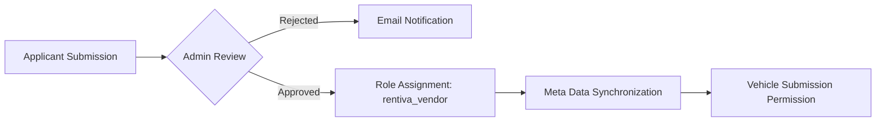
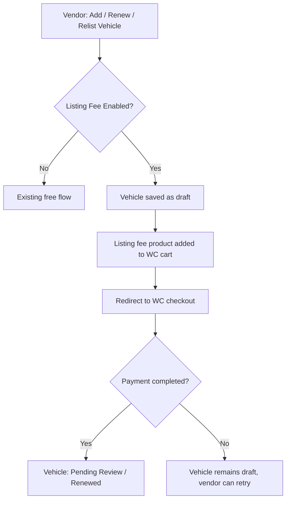

  

:::info Purpose
Rentiva can transform from a centralized vehicle rental system into a Multi-Vendor marketplace. This document explains the vendor lifecycle in technical detail.
:::

# 🤝 Vendor Management

The stages a user must pass through to become a Vendor in the system, and the technical structures behind that process, are summarized below.

---

## 🏗️ 1. Vendor Role & Authorization

### `rentiva_vendor` Role
Every approved vendor is assigned this role, which comes with the following capabilities:
- `edit_posts`: Can add their own vehicles.
- `upload_files`: Can upload vehicle images.
- `read`: Can access the vendor dashboard.

### 🛡️ Ownership Enforcement (`VendorOwnershipEnforcer`)
The `user_has_cap` filter is used to prevent vendors from accessing each other's vehicles or bookings:
- A vendor can only edit `vehicle` records where the `post_author` value matches their own `user_id`.
- The "All Vehicles" list in the admin portal is filtered to show only the vendor's own records.

---

## 📋 2. Application Management (`mhm_vendor_app`)

Vendor applicant data is stored within the `mhm_vendor_app` Custom Post Type (CPT):
- **Onboarding Flow:** `Pending` → `Approved` / `Rejected`.
- **Data Security:** IBAN data collected during application is encrypted using `VendorApplicationManager::encrypt_iban()` with the **AES-256-CBC** method.
- **Document Tracking:** Identity, driver's license, and proof of address documents are associated with the WordPress Media Library under `_vendor_doc_*` meta keys.

---

## ⚙️ 3. Operational Controls

### Approval & Meta Synchronization (`VendorOnboardingController`)
When an admin approves an application:
1. Phone, city, and IBAN data from the `mhm_vendor_app` record are copied to the user's (WP_User) meta tables.
2. The user's role is upgraded from `customer` to `rentiva_vendor`.
3. The `mhm_rentiva_vendor_approved` hook is triggered and a welcome email is sent.

### Profile Management (`VendorProfileExtension`)
The WordPress profile page (`wp-admin/profile.php`) is extended with vendor-specific fields:
- **Store Information:** Bio, tax number, and service areas.
- **Financial Information:** Masked IBAN display (e.g., TR***5678).

### Vendor Settings Page (v4.23.1)

The settings page in the vendor dashboard (`vendor-settings.php`) was completely redesigned in v4.23.1:

- **CSS Architecture:** All inline styles removed and moved to `vendor-forms.css` using the `.mhm-vendor-form__*` CSS class structure.
- **New Fields:** Account Holder and Tax Office fields added.
- **City Selection:** Uses the SelectWoo component (`CityHelper::render_select()`) instead of a text input.
- **Notification System:** Success/error notifications standardized using the `mhm-vendor-notice` class structure.

:::tip Technical Note
All form fields on the vendor settings page are styled using BEM-like classes such as `.mhm-vendor-form__group`, `.mhm-vendor-form__label`, `.mhm-vendor-form__input`. Follow the same class structure when adding new fields.
:::

---

## Lifecycle Summary

---

## 🚐 5. Vendor Transfer Location & Route Management (v4.23.0)

With v4.23.0, vendors can select locations and routes for transfer services:

### City-Based Filtering
On the vendor vehicle submission form (`[rentiva_vehicle_submit]`), only **locations** and **routes** within the city specified in the vendor's application are listed. This is part of the **City → Point** hierarchy.

### Per-Route Pricing
- The vendor selects the routes they want to serve.
- For each route, they enter their own price within the `min_price` — `max_price` range set by the admin.
- Capacity details (passengers, luggage) are defined at the vehicle level.

### Meta Structure
- `_mhm_rentiva_transfer_locations`: Locations the vendor serves (array)
- `_mhm_rentiva_transfer_routes`: Routes the vendor serves (array)
- `_mhm_rentiva_transfer_route_prices`: Per-route vendor prices (JSON)

### Admin View
On the vehicle edit screen (`VehicleTransferMetaBox`), the vendor's city and their selected locations/routes are displayed.

---

## 🔄 Vehicle Lifecycle Management (v4.24.0)

A comprehensive vehicle lifecycle system was implemented in v4.24.0:

| Feature | Detail |
|---------|-------|
| **Statuses** | Active / Paused / Withdrawn / Expired / Pending Review |
| **Listing period** | 90 days (admin-configurable), renewable by vendor |
| **Cancellation penalty system** | Graduated penalty points (2nd withdrawal 10%, 3rd+ 25%) |
| **Reliability score** | 0–100 performance rating |
| **Cooldown period** | 7-day waiting period after withdrawal |
| **Anti-gaming** | Cancelled booking dates blocked for 30 days |

### Remaining Time Display on Vendor Vehicle Cards (v4.24.1)

Each vehicle card in the vendor dashboard shows the remaining listing time:

| Status | Display | Color |
|-------|----------|------|
| > 50% time remaining | "Remaining: X days" | 🟢 Green |
| 20%–50% time remaining | "Remaining: X days" | 🟡 Yellow |
| < 20% time remaining | "Remaining: X days" | 🔴 Red |
| Expired | "Expired" badge | — |

**CSS classes:** `.mhm-vendor-listing-card__remaining` with `.is-green`, `.is-yellow`, `.is-red` variants.

---

## 💰 Paid Listing System (v4.24.1)

Vendors may be required to pay via WooCommerce to publish a vehicle listing. This feature can be toggled by the admin.

### Admin Settings (Settings → Vendor Marketplace → Listing Fee)

| Setting | Type | Default | Description |
|------|-----|-----------|----------|
| Enable Listing Fee | Checkbox | Off | Enable/disable the paid listing system |
| Fee Model | Select | One-Time | `one_time` or `per_period` (every 90-day period) |
| Listing Fee Amount | Number | 0 | Fee amount in store currency |

### Payment Flow

### Trigger Points

| Action | Free Flow | Paid Flow |
|-------|---------------|-------------|
| **New Vehicle** | Form → Pending Review | Form → Draft → WC Payment → Pending Review |
| **Renewal** (expired) | AJAX → Lifecycle renewal | AJAX → WC Payment → Lifecycle renewal |
| **Relist** (withdrawn) | AJAX → Lifecycle relist | AJAX → WC Payment → Lifecycle relist |

### WooCommerce Product

- **Type:** `WC_Product_Simple` (virtual, hidden)
- **SKU:** `mhm-rentiva-listing-fee`
- **Visibility:** Hidden in the store (not shown in shop/search results)
- **Price:** Dynamically read from admin settings
- **Cart meta:** `_mhm_listing_vehicle_id`, `_mhm_listing_action` (new/renew/relist)
- **Auto-creation:** Automatically created when the feature is first enabled

### Grandfather Rule

- Existing active vehicles are not affected when the feature is enabled
- Renewal payment is required when the 90-day listing period expires
- No retroactive fees applied

### Commission Relationship

The listing fee and commission are **independent of each other:**
- Vendor pays the listing fee (upfront, per listing)
- Vendor pays commission (percentage, per booking)
- There is no discount or offset between the two

### Technical Class

**`ListingFeeManager`** (`src/Admin/Vehicle/ListingFeeManager.php`):
- `is_enabled()` — Checks whether the feature is active
- `requires_payment(string $action)` — Determines if payment is required for the given action
- `get_or_create_product()` — Creates or returns the existing WC product
- `add_to_cart(int $vehicle_id, string $action)` — Adds to cart and returns the payment URL
- `on_order_completed()` — Publishes the vehicle when the order is completed

---

## 🔗 WooCommerce My Account — Vendor Dashboard Menu Link (v4.24.1)

Users with the vendor role see a **"Vendor Dashboard"** menu link in the sidebar on the WooCommerce My Account page. This link redirects to `/panel/`.

| User Role | Menu Item | URL |
|----------------|------------|-----|
| `rentiva_vendor` | Vendor Dashboard | `/panel/` |
| Other roles (customer, etc.) | Become a Vendor | `/hesabim/vendor-apply/` |

**Technical Details:**
- `WooCommerceIntegration::add_menu_items()` — Menu item is switched based on vendor role check
- `WooCommerceIntegration::vendor_panel_endpoint_url()` — Redirects the `vendor-panel` endpoint to the `/panel/` page
- The vendor application URL slug is translatable via the `_x()` function (SEO-compatible)

---

## Known Issues (Discovered in v4.23.1)

| Issue | Detail | Status |
|-------|-------|-------|
| Vehicle status filter | `_mhm_vehicle_status` is not checked in search queries — vehicles in maintenance are visible. | Discovered |
| Vendor suspension | `VendorOnboardingController::suspend()` does not unpublish vendor vehicles. | Discovered |

---

## Section Summary
- Data isolation is guaranteed by `VendorOwnershipEnforcer`.
- All critical application data is stored encrypted.
- `rentiva_vendor` capabilities apply only to posts owned by the vendor.
- Vendors can only access locations and routes in their own city. *(v4.23.0)*
- The vendor settings page was redesigned with a BEM-like CSS class structure. *(v4.23.1)*
- City selection uses the SelectWoo component across all forms. *(v4.23.1)*
- Vehicle lifecycle system (90-day listing, pausing, renewal, withdrawal) implemented. *(v4.24.0)*
- Paid listing system: WooCommerce checkout-based payment gate, admin-configurable. *(v4.24.1)*
- Remaining time display on vendor vehicle cards (color-coded). *(v4.24.1)*
- "Vendor Dashboard" link added for vendors in the WC My Account menu. *(v4.24.1)*

## Changelog
| Date | Version | Note |
|---|---|---|
| 23.04.2026 | 4.27.2 | English translation added. |
| 01.04.2026 | 4.24.1 | Paid listing system (ListingFeeManager), remaining time display, WC My Account "Vendor Dashboard" menu link, 18 new tests. |
| 29.03.2026 | 4.24.0 | Vehicle lifecycle system implemented (Phases 0-4, 6-7). Pause, renewal, withdrawal, reliability score. |
| 28.03.2026 | 4.23.1 | Vendor settings page redesign, Account Holder and Tax Office fields, city SelectWoo migration. |
| 26.03.2026 | 4.23.0 | Vendor Transfer Location/Route management, City→Point hierarchy, and per-route pricing added. |
| 19.03.2026 | 4.21.2 | CPT, Enforcer, and Onboarding details added. |
