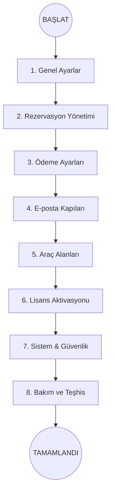

  

# ⚙️ Temel Yapılandırma Yol Haritası

Eklentiyi kurduktan sonra, operasyonel süreçlerin sağlıklı işlemesi için ayarların belirli bir mantık çerçevesinde yapılması gerekir. Bu bölüm, sistemin "kalbi" sayılan temel yapılandırma adımlarını kapsar.

:::tip YAPILANDIRMA REHBERİ
Sistemi eksiksiz kurmak için aşağıdaki kategorize edilmiş kartları takip edin. Her kart, ilgili ayar grubuna hızlı ulaşım sağlar.
:::

---

  

    

      <h3 className="cardTitle">🏢 1. Genel Ayarlar</h3>
      
Şirket bilgileri, para birimi ve temel çalışma modlarını belirleyin.

      <a className="button button--secondary button--block" href="/mhm-rentiva-docs/docs/core-configuration/settings">Genel Ayarlar</a>
    

  

  

    

      <h3 className="cardTitle">📅 2. Rezervasyon</h3>
      
Kiralama süreleri, depozito oranları ve rezervasyon davranışları.

      <a className="button button--secondary button--block" href="/mhm-rentiva-docs/docs/core-configuration/booking-settings">Rezervasyon</a>
    

  

  

    

      <h3 className="cardTitle">💳 3. Ödemeler</h3>
      
WooCommerce ödeme geçitleri ve tahsilat kurallarını yapılandırın.

      <a className="button button--secondary button--block" href="/mhm-rentiva-docs/docs/core-configuration/payments">Ödeme Ayarları</a>
    

  

  

    

      <h3 className="cardTitle">📧 4. Bildirimler</h3>
      
E-posta şablonları, SMTP ayarları ve otomatik bilgilendirmeler.

      <a className="button button--secondary button--block" href="/mhm-rentiva-docs/docs/core-configuration/emails">E-posta Ayarları</a>
    

  

  

    

      <h3 className="cardTitle">🏎️ 5. Araç Alanları</h3>
      
Teknik veriler (yakıt, vites vb.) ve araç özellikleri tanımı.

      <a className="button button--secondary button--block" href="/mhm-rentiva-docs/docs/core-configuration/vehicle-settings">Araç Ayarları</a>
    

  

  

    

      <h3 className="cardTitle">🔑 6. Lisans</h3>
      
Pro özelliklerin kilidini açmak için anahtarınızı aktif edin.

      <a className="button button--secondary button--block" href="/mhm-rentiva-docs/docs/core-configuration/license">Lisans Yönetimi</a>
    

  

  

    

      <h3 className="cardTitle">⚡ 7. Sistem & Performans</h3>
      
Önbellekleme, güvenlik kuralları ve sistem sağlığı denetimi.

      <a className="button button--secondary button--block" href="/mhm-rentiva-docs/docs/core-configuration/system-performance">Sistem & Hız</a>
    

  

  

    

      <h3 className="cardTitle">🛠️ 8. Bakım & Araçlar</h3>
      
Veritabanı temizliği, cron izleme ve teşhis araçları.

      <a className="button button--secondary button--block" href="/mhm-rentiva-docs/docs/core-configuration/maintenance">Bakım Sayfası</a>
    

  

---

## 📈 Yapılandırma Akış Diyagramı

---

### Bölüm Özeti
- Doğru sıralı yapılandırma, sistem çakışmalarını önler.
- En sonda sistemi **Bakım ve Teşhis** araçlarıyla doğrulamanız önerilir.

## Değişiklik Günlüğü
| Tarih | Sürüm | Not |
|---|---|---|
| 19.03.2026 | 4.21.2 | Temel Yapılandırma için premium kart tasarımlı yol haritası oluşturuldu. |
