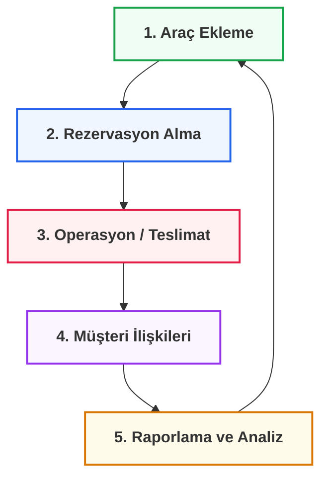

  

# 🚗 Özellikler ve Kullanım Yol Haritası

MHM Rentiva'nın sunduğu zengin özellikleri en verimli şekilde kullanabilmeniz için aşağıdaki operasyonel sırayı takip etmenizi öneririz.

:::tip KULLANIM REHBERİ
Günlük kiralama operasyonlarınızı yönetmek, araç eklemek ve rapor alabilmek için aşağıdaki kategorize edilmiş kartları kullanın.
:::

---

  

    

      <h3 className="cardTitle">🏎️ 1. Araç ve Envanter</h3>
      
Araç ekleme, kategori yönetimi, fiyatlandırma ve global araç ayarları.

      <a className="button button--secondary button--block" href="/docs/features-usage/vehicles">Araç Yönetimi</a>
    

  

  

    

      <h3 className="cardTitle">📅 2. Rezervasyon Takibi</h3>
      
Gelen talepleri yönetin, takvimi izleyin ve rezervasyon detaylarını inceleyin.

      <a className="button button--secondary button--block" href="/docs/features-usage/bookings">Rezervasyonlar</a>
    

  

  

    

      <h3 className="cardTitle">✨ 3. Ek Hizmetler & VIP</h3>
      
Bebek koltuğu, sigorta gibi ekstralar ve VIP transfer güzergah tanımları.

      <a className="button button--secondary button--block" href="/docs/features-usage/additional-services-usage">Ekstra Hizmetler</a>
    

  

  

    

      <h3 className="cardTitle">💬 4. Müşteri & İletişim</h3>
      
Müşteri portalı yönetimi, sadakat programı ve dahili mesajlaşma sistemi.

      <a className="button button--secondary button--block" href="/docs/features-usage/customers">Müşteri Yönetimi</a>
    

  

  

    

      <h3 className="cardTitle">📊 5. Raporlama ve Analiz</h3>
      
İşletme performans grafikleri, gelir raporları ve verilerin dışa aktarımı.

      <a className="button button--secondary button--block" href="/docs/features-usage/reports">Raporlar ve Export</a>
    

  

---

## 📈 Operasyonel Döngü

---

### Bölüm Özeti
- Bu bölüm, eklentinin günlük kullanımına yönelik iş akışlarını kapsar.
- Operasyonel döngü, sürdürülebilir bir kiralama işletmesi için tasarlanmıştır.

## Değişiklik Günlüğü
| Tarih | Sürüm | Not |
|---|---|---|
| 21.03.2026 | 4.21.3 | Tüm kart linkleri (Araçlar, Rezervasyonlar, Ekstra Hizmetler vb.) relative path olarak düzeltildi. |
| 19.03.2026 | 4.21.2 | Özellikler ve Kullanım için premium kart tasarımlı yol haritası oluşturuldu. |
