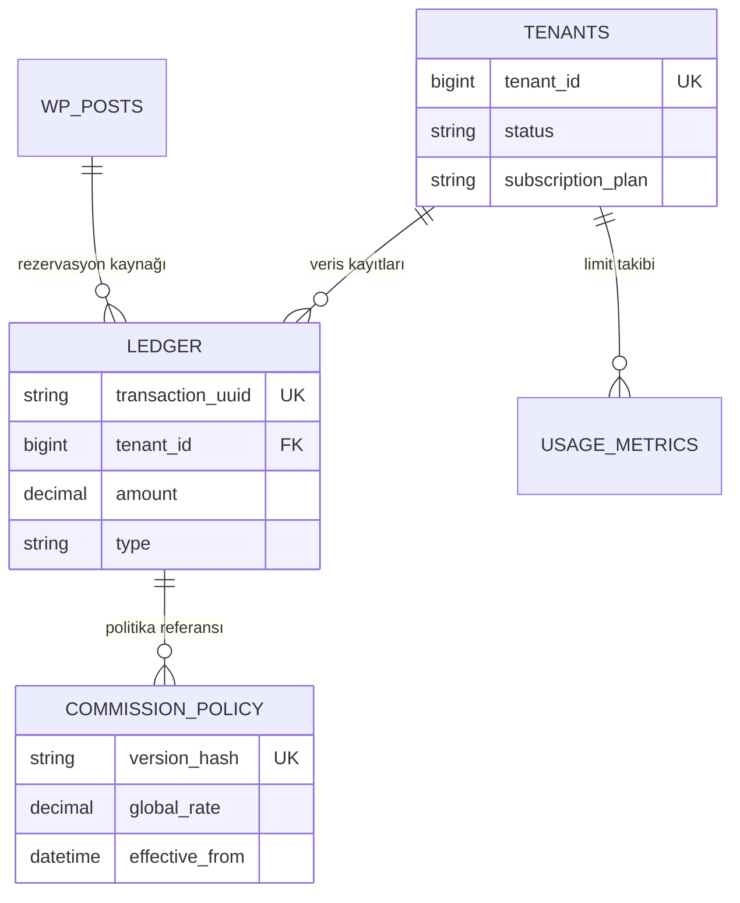

  

:::info Amaç
Bu sayfa, MHM Rentiva'nın hibrit veritabanı yapısını (WP Core + Native Custom Tables), tablo şemalarını ve veri bütünlüğü standartlarını açıklar.
:::

# 🗄️ Veritabanı Mimarisi

MHM Rentiva, yüksek performans ve veri bütünlüğü gereksinimleri için **WordPress Post/User Meta** sistemi ile birlikte **Yüksek Performanslı Özel Tablolar** (Custom Tables) kullanan hibrit bir mimariye sahiptir.

## 📊 Özel Tablolar (Custom Tables)

Eklenti, finansal kayıtlar ve SaaS operasyonları için WordPress'in standart tablolarını bypass ederek doğrudan SQL üzerinde optimize edilmiş şu tabloları kullanır:

| Tablo Adı | Amaç | Kritik Alanlar |
| :--- | :--- | :--- |
| `wp_mhm_rentiva_ledger` | Değiştirilemez finansal defter (Immutable Ledger). | `transaction_uuid`, `amount`, `tenant_id` |
| `wp_mhm_rentiva_commission_policy` | Komisyon politikalarının versiyonlanmış kayıtları. | `version_hash`, `global_rate`, `effective_from` |
| `wp_mhm_rentiva_tenants` | Çoklu kiracı (Multi-tenant) kayıt ve kotaları. | `tenant_id`, `status`, `subscription_plan` |
| `wp_mhm_rentiva_usage_metrics` | SaaS kullanım limitleri ve metrik takibi. | `metric_type`, `metric_value`, `cycle_start` |

### 🏗️ Veri Bütünlüğü Prensipleri
- **Immutability (Değiştirilemezlik):** `ledger` tablosundaki kayıtlar asla güncellenmez veya silinmez. Düzeltmeler yeni bir ters kayıt (offsetting entry) ile yapılır.
- **Tenant Isolation:** Tüm özel tablolarda `tenant_id` alanı mevcuttur. Veriler veritabanı seviyesinde mantıksal olarak izole edilmiştir.
- **Audit Trail:** Komisyon politikaları `version_hash` (SHA-256) ile imzalanarak mali denetim izi oluşturulur.

---

## 🔑 Meta Key Standartları

Operasyonel veriler (araç özellikleri, müşteri tercihleri vb.) WordPress meta tablolarında şu prefix kuralı ile saklanır:
`_mhm_rentiva_[kategori]_[alan_adı]`

| Kategori | Örnek Key |
| :--- | :--- |
| **Araç (Vehicle)** | `_mhm_rentiva_vehicle_license_plate` |
| **Rezervasyon** | `_mhm_rentiva_booking_payout_status` |
| **Müşteri** | `_mhm_rentiva_customer_banned` |

---

## 🧬 Tablo İlişkileri (ER)

---

## Transfer Tabloları

Transfer modulu için iki ozel tablo kullanılır:

| Tablo Adi | Amac | Kritik Alanlar |
| :--- | :--- | :--- |
| `wp_rentiva_transfer_locations` | Transfer noktalari (havalimani, otel, liman vb.) | `name`, `type`, `city`, `lat`, `lng` |
| `wp_rentiva_transfer_routes` | Iki lokasyon arasındaki rota tanımlari | `origin_id`, `destination_id`, `base_price`, `min_price`, `max_price`, `distance_km` |

### DatabaseMigrator v3.4.0 Değişiklikleri
- `city` VARCHAR(100) kolonu `rentiva_transfer_locations` tablosuna eklendi (vendor marketplace şehir bazli filtreleme için)
- `max_price` DECIMAL(10,2) kolonu `rentiva_transfer_routes` tablosuna eklendi (vendor fiyat araligi ust siniri)

---

## Bakim ve Gelistirme

- **Migrations:** Veritabanı semasi `src/Core/Database/Migrations/` altında tanımlanmıştir. `MultiTenantMigration` ve `LedgerMigration` siniflari `dbDelta` kullanarak guvenli güncelleme yapar.
- **Audit Tool:** Veritabanı tutarliligi `wp mhm-rentiva audit` CLI komutlari ile dogrulanabilir.

---

## Uninstaller Tablo Listesi

Eklenti kaldırıldıginda asagidaki tablolar temizlenir:

| Tablo | Kategori |
|---|---|
| `wp_mhm_rentiva_ledger` | Finans |
| `wp_mhm_rentiva_commission_policy` | Finans |
| `wp_mhm_rentiva_tenants` | SaaS |
| `wp_mhm_rentiva_usage_metrics` | SaaS |
| `wp_mhm_notification_queue` | Sistem |
| `wp_mhm_payment_log` | Sistem |
| `wp_mhm_sessions` | Sistem |
| `wp_rentiva_transfer_locations` | Transfer |
| `wp_rentiva_transfer_routes` | Transfer |

Legacy `mhm_rentiva_transfer_*` tabloları da varsa temizlenir.

## Bölüm Sonu Özeti
- Kritik finans verileri **Custom Tables** uzerinde SQL gucuyle yonetilir.
- Transfer tabloları `city` ve `max_price` kolonlariyla vendor marketplace'i destekler.
- Esnek veriler **WP Meta** sisteminde saklanir.
- **Multi-tenancy** yapısı `tenant_id` parametresiyle tum katmanlara yayılmıştır.
- Uninstaller 9 ozel tablo + legacy tabloları temizler.

## Değişiklik Günlüğü
| Tarih | Sürüm | Not |
|---|---|---|
| 27.03.2026 | 4.23.0 | Transfer tabloları (locations + routes), DatabaseMigrator v3.4.0 değişiklikleri (city, max_price), Uninstaller tablo listesi (9 tablo + legacy) eklendi. |
| 19.03.2026 | 4.23.0 | Veritabanı dokumantasyonu SaaS ve Finans mimarisine gore bastan yazildi. |

