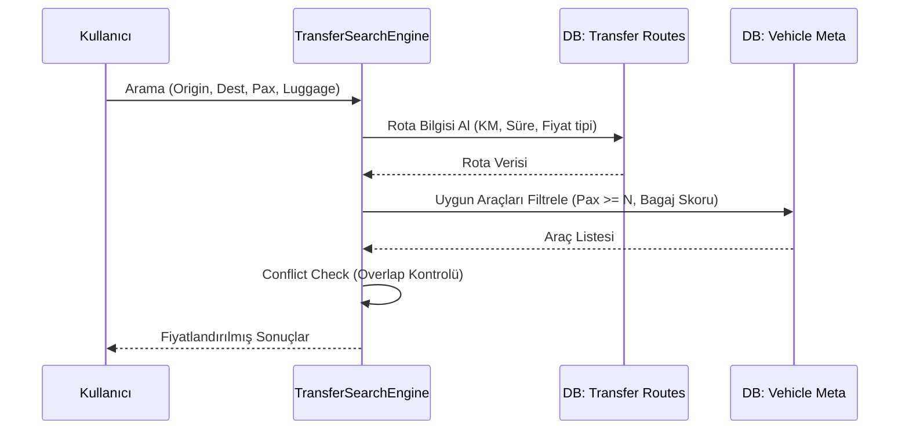

  

:::info Amaç
Bu sayfa, transfer modülünün çekirdek sınıflarını, rota bazlı fiyatlandırma motorunu ve veri akışını açıklar.
:::

# 🚕 MHM Rentiva Transfer Mimarisi

Transfer modülü, araç kiralama modülünden farklı olarak "Zaman + Konum" tabanlı bir arama ve fiyatlandırma motoru üzerine kurulu bir alt sistemdir.

## 🛠️ Ana Bileşenler (Sınıf Haritası)

Transfer operasyonları şu temel sınıflar tarafından yönetilir:

| Sinif | Gorevi |
| :--- | :--- |
| `TransferSearchEngine` | Rota bazli araç filtreleme, vendor fiyatlandırmasi ve bagaj skoru filtrelerini uygulayan ana motor. |
| `LocationProvider` | Lokasyon sorgulama servisi; `get_by_city()` metodu ile şehir bazli filtreleme destekler. |
| `TransferShortcodes` | Frontend arama formlari ve sonuc listelerini (`[rentiva_transfer_search]`) yonetir. |
| `TransferCartIntegration` | Secilen transfer hizmetini WooCommerce sepetine entegre eder. |
| `TransferBookingHandler` | Checkout sonrası transfer detaylarini (Rota ID, KM, Sure) rezervasyona kaydeder. |

---

## 🔄 Veri Akışı ve Arama Süreci

 Bir transfer araması yapıldığında sistem şu adımları izler:

---

## 🔍 Fiyatlandırma ve Kapasite Mantığı

### 1. Rota Bazli Fiyatlandırma
Transfer fiyatlari `wp_rentiva_transfer_routes` tablosundaki kurallara gore hesaplanir:
- **Sabit (Fixed):** Belirlenen `base_price` dogrudan uygulanır.
- **Mesafe (Distance):** `base_price * distance_km` formulu kullanılır. Opsiyonel olarak `min_price` alt siniri eklenebilir.
- **Carpan (Multiplier):** Araç bazli carpan (`_mhm_transfer_price_multiplier`) ile VIP araclar için fiyat otomatik arttirilabilir.

### 1a. Vendor Fiyatlandırmasi (v4.23.0)
Vendor marketplace entegrasyonunda fiyatlandırma su sekilde çalışır:
- Admin her rota için `min_price` ve `max_price` araligi belirler.
- Vendor, kendi aracına rota bazında fiyat atar (`_mhm_rentiva_transfer_route_prices` JSON meta).
- `TransferSearchEngine` once vendor fiyatini kontrol eder; yoksa rota `base_price` değerine fallback yapar.
- Vendor fiyati admin araliginin disindaysa gecersiz sayilir.

### 2. Bagaj Skoru Hesaplama
Sistem, araçların bagaj kapasitesini şu matematiksel modelle hesaplar:
`Luggage Score = (Küçük Bagaj * 1) + (Büyük Bagaj * 2.5)`
Arama sırasında istenen bagaj yükü, aracın `_mhm_transfer_max_luggage_score` değerinden büyükse araç elenir.

---

## 🛡️ Kritik Hook ve Aksiyonlar

- **AJAX Arama:** `mhm_rentiva_transfer_search_results` - Arama sonuçlarını döndürür.
- **Sepete Ekleme:** `rentiva_transfer_add_to_cart` - Transfer verilerini meta alanlarıyla sepete yollar.
- **Sipariş Oluşturma:** `woocommerce_checkout_create_order_line_item` - Rota detaylarını kalıcı sipariş kaydına dönüştürür.

## Şehir Bazli Filtreleme (v4.23.0)

`LocationProvider::get_by_city()` metodu, vendor'in kayıtli olduğu şehirdeki lokasyonlari sorgular. Bu yapi su akilsa kullanılır:

1. Vendor araç ekleme formunda (`VehicleSubmit.php`) sadece kendi sehrindeki lokasyonlar ve rotalar gosterilir.
2. Admin panelinde `VehicleTransferMetaBox` vendor şehir bilgisini goruntular.

---

## Araç Meta Yapısı

Transfer modulu asagidaki meta key'leri kullanir:

| Meta Key | Tip | Açıklama |
|---|---|---|
| `_mhm_rentiva_transfer_locations` | array | Aracın hizmet verdiği lokasyon ID'leri |
| `_mhm_rentiva_transfer_routes` | array | Aracın hizmet verdiği rota ID'leri |
| `_mhm_rentiva_transfer_route_prices` | JSON | Rota bazında vendor fiyatlari (`{route_id: price}`) |

---

## Bölüm Sonu Özeti
- Transfer modulu, rota tabanlı calisan bagimsiz bir fiyatlama motorudur.
- **Vendor fiyatlandırmasi:** Admin `min_price`/`max_price` araligi belirler, vendor kendi fiyatini set eder.
- **Şehir filtreleme:** `LocationProvider::get_by_city()` ile vendor sadece kendi sehrindeki rotalari gorur.
- **Bagaj Skoru** ve **Yolcu Kapasitesi** en kritik veri filtreleridir.
- Rezervasyon cakismalari `Util::has_overlap()` üzerinden cekirdek sistemle ortak kontrol edilir.

## Değişiklik Günlüğü
| Tarih | Sürüm | Not |
|---|---|---|
| 27.03.2026 | 4.23.0 | Vendor fiyatlandırmasi, LocationProvider::get_by_city(), şehir bazli filtreleme, araç meta key'leri eklendi. |
| 19.03.2026 | 4.21.2 | Transfer mimarisi, rota bazli fiyatlandırma ve bagaj yönetimi detaylariyla güncellendi. |
