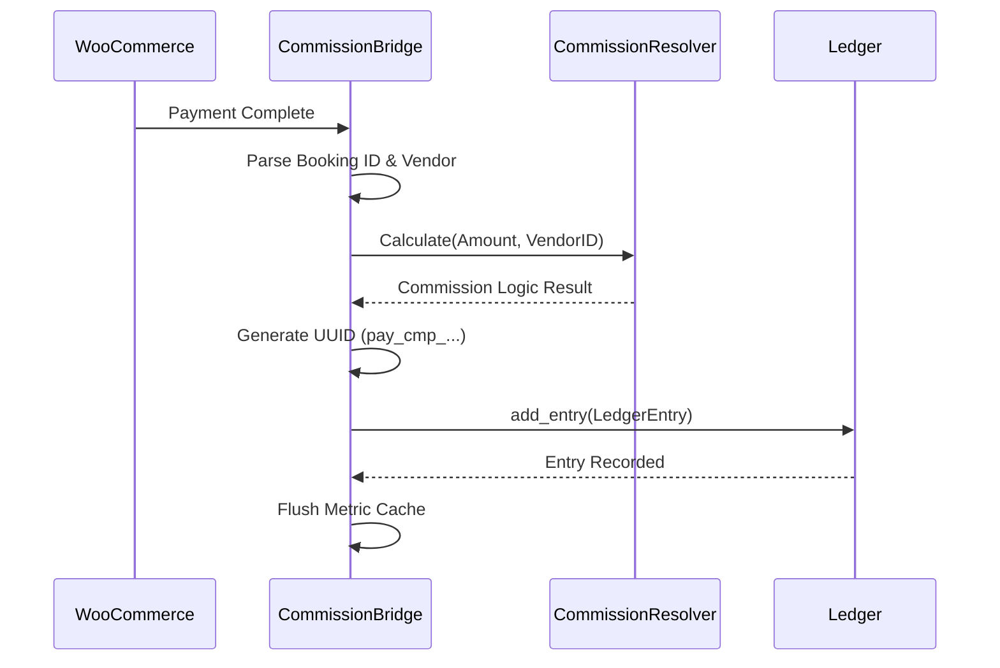

  

:::info Amaç
Bu sayfa, `CommissionBridge` bileşeninin WooCommerce siparişleri ile Rentiva finansal çekirdeği (Ledger) arasındaki veri akışını nasıl yönettiğini açıklar.
:::

# 🌉 WooCommerce Commission Bridge

`CommissionBridge`, e-ticaret katmanı (WooCommerce) ile finansal kayıt katmanı (Ledger) arasında bir tercüman görevi görür. Sipariş olaylarını dinler ve bunları finansal defter kayıtlarına dönüştürür.

## 🚀 Tetikleyici Olaylar (Hooks)

Köprü, WooCommerce üzerindeki şu kritik olayları izleyerek çalışır:

- **`woocommerce_payment_complete`**: Ödeme başarıyla tamamlandığında tetiklenir.
- **`woocommerce_order_status_completed`**: Sipariş manuel veya otomatik olarak tamamlandığında tetiklenir.
- **`woocommerce_order_refunded`**: İade işlemlerinde ters kayıt (Reverse Entry) oluşturmak için kullanılır.

---

## 🔄 Finansal İşleme Akışı

Bir sipariş ödendiğinde sistem şu adımları izler:

---

## 🛠️ Temel Özellikler ve Mantık

### 1. Idempotency (Mükerrer Kayıt Engelleme)
Her kayıt için `pay_cmp_{order_id}_{booking_id}` formatında benzersiz bir **UUID** üretilir. WooCommerce aynı olayı birden fazla kez tetiklese bile, `Ledger` sınıfı bu UUID sayesinde mükerrer kayıt oluşmasını engeller.

### 2. İade ve Ters Kayıt (Refund Handling)
Sipariş iade edildiğinde (`on_order_refunded`), sistem mevcut kaydı silmek yerine tam tersi değerlere sahip (`-` bakiye) yeni bir **Refund Entry** oluşturur. Bu, finansal denetim (Audit Trail) bütünlüğü için zorunludur.

### 3. Metrik Senkronizasyonu
Bir finansal kayıt deftere işlendiği anda, `MetricCacheManager` tetiklenerek Vendor ve Araç bazlı performans grafiklerinin anında güncellenmesi sağlanır.

---

## 📋 Veri Eşleme (Mapping)

| WooCommerce Alanı | Ledger Alanı | Açıklama |
| :--- | :--- | :--- |
| `order_id` | `parent_id` / `source_id` | Kaynağın WC siparişi olduğunu belirtir. |
| `order_total` | `gross_amount` | Vergi dahil toplam tutar. |
| `currency` | `currency` | Siparişin para birimi. |
| `_mhm_booking_id` | `reference_id` | Rentiva rezervasyon referansı. |

## Bölüm Sonu Özeti
- `CommissionBridge`, WooCommerce olaylarını finansal "Transaction" yapılarına dönüştürür.
- **Ters kayıt mantığı** ile veri silinmesinin önüne geçilir.
- **UUID** kullanımı ile veri tutarlılığı (idempotency) sağlanır.

## Değişiklik Günlüğü
| Tarih | Sürüm | Not |
|---|---|---|
| 19.03.2026 | 4.21.2 | Sayfa, Refund mantığı ve Idempotency detaylarıyla güncellendi. |
