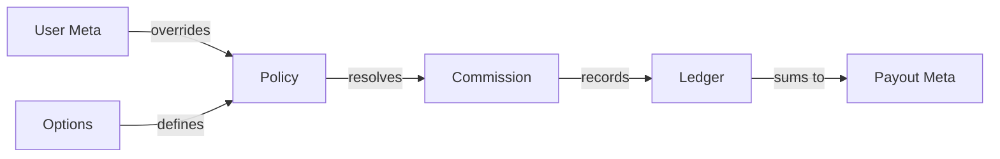

  

:::info Pro özelliği
Bu sayfa **MHM Rentiva Pro** eklentisinin bir yeteneğini anlatır. WordPress.org'daki ücretsiz
Lite sürümünün parçası değildir; Lite'ın yanına kurulu Pro ve geçerli bir lisans gerektirir.
Tam ayrım için: [Sürümler — Lite ve Pro farkı](/docs/). Pro'yu edinmek için: [wpalemi.com/rentiva](https://wpalemi.com/rentiva/).
:::

:::info Amaç
Bu sayfa, MHM Rentiva finansal modülünde kullanılan tüm anahtar kelimelerin, veritabanı alanlarının ve teknik tanımların standart referans dökümantasyonudur.
:::

# 📖 Finansal Veri Sözlüğü

Finansal veriler Rentiva ekosisteminde üç ana katmanda saklanır: **Global Ayarlar (Options)**, **Kullanıcı Bilgileri (User Meta)** ve **İşlem Detayları (Payout/Booking Meta)**.

## ⚙️ Global Ayarlar (Options)
`wp_options` tablosunda saklanan sistem geneli finansal konfigürasyonlar:

| Anahtar (Key) | Tip | Açıklama |
| :--- | :--- | :--- |
| `mhmrentiva_min_payout_amount` | `float` | Bir satıcının ödeme talep edebilmesi için gereken minimum bakiye. |
| `mhmrentiva_global_payout_freeze` | `bool` | Sistem genelinde tüm ödemeleri durduran acil durum anahtarı. |
| `mhmrentiva_payout_webhook_secret`| `string` | Payout bildirimleri için kullanılan HMAC imzalı secret key. |
| `mhmrentiva_commission_tiers` | `json` | Satış hacmine göre indirim oranlarını belirleyen eşik değerleri. |

---

## 👤 Kullanıcı Finansal Verileri (User Meta)
`wp_usermeta` tablosunda satıcı (Vendor) bazlı saklanan veriler:

| Anahtar (Key) | Tip | Açıklama |
| :--- | :--- | :--- |
| `_mhmrentiva_vendor_commission_rate` | `float` | Satıcıya özel tanımlanmış sabit komisyon oranı (Override). |
| `_mhmrentiva_vendor_payout_freeze` | `bool` | Sadece bu satıcının ödeme almasını engelleyen blokaj durumu. |
| `_mhmrentiva_vendor_tier_id` | `string` | Satıcının şu an dahil olduğu performans kategorisi. |

---

## 💰 Payout (Ödeme) Verileri (Post Meta)
`mhmrentiva_payout` post type altında saklanan meta veriler:

| Anahtar (Key) | Tip | Açıklama |
| :--- | :--- | :--- |
| `_mhmrentiva_payout_amount` | `float` | Talep edilen veya ödenen net tutar. |
| `_mhmrentiva_payout_status` | `string` | Durum: `pending`, `processing`, `completed`, `rejected`. |
| `_mhmrentiva_payout_external_ref` | `string` | Banka veya ödeme geçidi (Stripe vb.) referans numarası. |
| `_mhmrentiva_payout_rejection_reason` | `string` | Reddedilen talepler için girilen açıklama metni. |

---

## 🔑 Yetkilendirme (Capabilities)
Finansal işlemleri yönetmek için gerekli WordPress yetkileri:

- **`mhmrentiva_approve_payout`**: Ödeme taleplerini onaylama yetkisi.
- **`mhmrentiva_freeze_payout`**: Ödemeleri durdurma/blokaj uygulama yetkisi.
- **`mhmrentiva_view_financial_audit`**: Audit loglarını ve Ledger detaylarını görme yetkisi.

---

## 🔄 Veri İlişki Haritası

```mermaid
graph LR
    U[User Meta] -- overrides --> P[Policy]
    O[Options] -- defines --> P
    P -- resolves --> C[Commission]
    C -- records --> L[Ledger]
    L -- sums to --> PM[Payout Meta]
```

## Bölüm Sonu Özeti
- Tüm finansal anahtarlar `_mhmrentiva_` ön eki ile (private meta) saklanır.
- Kritik işlemler (Örn: `payout_status`) sadece yetkili (Capabilities) kullanıcılar tarafından değiştirilebilir.
- Ledger tablosundaki alanlar için [Ledger Modeli](./financial-ledger-model) sayfasına bakınız.

## Değişiklik Günlüğü
| Tarih | Sürüm | Not |
|---|---|---|
| 19.03.2026 | 4.21.2 | Sayfa, eklentinin güncel Meta ve Option anahtarlarına göre güncellendi. |
