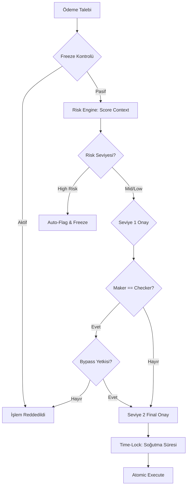

  

:::info Amaç
Bu sayfa, finansal ödeme (Payout) sürecindeki risk analizini, onay hiyerarşisini ve denetim (Audit) mekanizmalarını açıklar.
:::

# ⚖️ Governance Kontrolleri

`GovernanceService`, finansal işlemlerin doğruluğunu ve güvenliğini sağlamak için tasarlanmış bir akıllı yönetişim katmanıdır. Finansal mekaniklerden bağımsız olarak, sadece "Kim, neyi, hangi riskle onaylayabilir?" sorusuna yanıt verir.

## 🛡️ Temel Güvenlik Katmanları

### 1. Freeze (Blokaj) Kontrolleri
Sistem, herhangi bir işlem başlatılmadan önce iki aşamalı blokaj kontrolü yapar:
- **Global Freeze:** `mhm_rentiva_global_payout_freeze` ayarı aktifse tüm ödemeler anında durur.
- **Vendor Freeze:** `_mhm_vendor_payout_freeze` metasını içeren satıcıların talepleri reddedilir.

### 2. Risk Engine (Deterministik Risk Analizi)
Sistem, her ödeme talebi için şu kriterlere göre bir risk puanı üretir:
- **Vendor Yaşı:** Yeni satıcılar daha yüksek risk puanı alır.
- **İptal Oranı:** Yüksek iade/iptal oranına sahip satıcılar takibe alınır.
- **Tutar Limiti:** Belirli eşiklerin üzerindeki ödemeler otomatik olarak "High Risk" işaretlenir.

### 3. Maker-Checker (Çift Onay Prensibi)
Dolandırıcılığı önlemek için hiçbir yönetici kendi başlattığı veya oluşturduğu bir ödemeyi tek başına onaylayamaz:
- **Maker:** Talebi oluşturan veya ilk incelemeyi yapan kişi.
- **Checker:** Nihai onayı veren farklı bir yetkili.
- *İstisna:** Sadece `mhm_rentiva_override_maker_checker` yetkisine sahip üst düzey yöneticiler bu kuralı bypass edebilir (ve bu işlem forensic loguna düşer).

---

## 🔄 Yönetişim İş Akışı

---

## 🏛️ Audit Trail (Denetim İzi)

Tüm yönetişim kararları `wp_mhm_rentiva_payout_audit` tablosunda **Immutable (Değiştirilemez)** olarak saklanır:
- **IP Hash:** Gizlilik korunarak işlem yapanın IP izi SHA-256 ile saklanır.
- **Action Constants:** `submit_payout`, `review_payout`, `finalize_payout`, `bypass_time_lock` gibi aksiyonlar kaydedilir.
- **Metadata JSON:** O anki risk puanı, iş akışı durumu ve bağlamsal detaylar her olayda damgalanır.

---

## ⏳ Time-Locks (Zaman Kilidi)
Onaylanan yüksek tutarlı ödemeler, `STATE_TIME_LOCKED` aşamasına alınır. Bu süreçte para rezerve edilir ancak ödeme kanalına (Webhook) hemen gönderilmez. Bu "soğutma süresi", hatalı veya şüpheli işlemleri geri çekmek için son güvenlik duvarıdır.

## Bölüm Sonu Özeti
- Güvenlik hiyerarşisi: **Freeze > Risk Engine > Maker-Checker > Time-Lock**.
- Tüm kararlar **payout_audit** tablosunda kalıcı olarak izlenebilir.
- `GovernanceService`, finansal hataları değil, süreç suistimallerini engeller.

## Değişiklik Günlüğü
| Tarih | Sürüm | Not |
|---|---|---|
| 19.03.2026 | 4.21.2 | Sayfa, GovernanceService'in risk motoru ve Maker-Checker yapısına göre güncellendi. |
