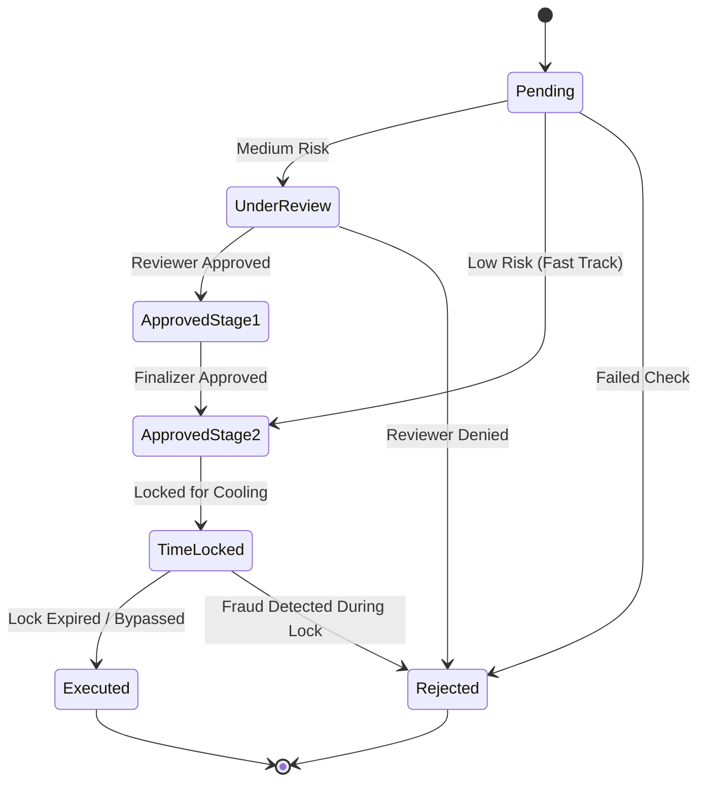

  

:::info Amaç
Bu sayfa, bir ödeme talebinin (Payout) oluşturulmasından kesinleşmesine kadar geçtiği iş akışı eyaletlerini, geçiş kurallarını ve güvenlik bariyerlerini açıklar.
:::

# 🔄 Payout Yaşam Döngüsü

MHM Rentiva, ödeme süreçlerini yönetmek için katı kurallara sahip bir **Approval State Machine** (Onay Eyalet Makinesi) kullanır. Her geçiş (`Transition`), hem sistemsel risk puanına hem de insan müdahalesine (Maker-Checker) tabidir.

---

## 🏗️ Eyaletler (States)

Sistemdeki her Payout talebi aşağıdaki eyaletlerden birinde bulunur:

| Eyalet | Kod | Açıklama |
| :--- | :--- | :--- |
| **Pending** | `pending` | Talep yeni oluşturuldu, risk analizi bekleniyor. |
| **Under Review** | `under_review` | Orta riskli talepler için manuel inceleme aşaması. |
| **Approved Stage 1** | `approved_stage_1` | İlk seviye onayı alınmış (İnceleme tamam). |
| **Approved Stage 2** | `approved_stage_2` | Nihai onay (Finalize) aşaması. |
| **Time Locked** | `time_locked` | Onaylandı ancak "Soğutma Süresi" (Cooling Period) içinde bekliyor. |
| **Executed** | `executed` | Ödeme başarıyla gerçekleştirildi (Ledger kapandı). |
| **Rejected** | `rejected` | Talep reddedildi, bakiye satıcıya iade edildi. |

---

## 🌳 Eyalet Geçiş Diyagramı

---

## 🛡️ Geçiş Kuralları (Transition Rules)

### 1. Maker-Checker Segregation
Bir ödemeyi onaylayan kişi (`Checker`), o ödemeyi başlatan veya hazırlayan kişi (`Maker`) ile aynı olamaz. Bu kural, dâhili suistimalleri önlemek için kod seviyesinde (`ApprovalStateMachine::validate_transition`) zorunlu kılınmıştır.

### 2. Fast-Track (Hızlı Geçiş)
Risk puanı **LOW** (Düşük) olan talepler, `Pending` eyaletinden doğrudan `Approved Stage 2` eyaletine geçebilir. Bu, operasyonel yükü azaltmak için güvenilir satıcılara uygulanan bir kolaylıktır.

### 3. Atomic Updates
Eyalet geçişleri veritabanında **nükleer (atomic)** olarak gerçekleştirilir. `UPDATE ... WHERE current_state = old_state` sorgusu kullanılarak, aynı ödeme talebi üzerinde iki yöneticinin aynı anda işlem yapması (Race Condition) engellenir.

---

## ⏳ Time-Lock ve Finalization
`Approved Stage 2` onayı alındığında, bakiye Ledger üzerinde `payout_debit` olarak nükleer şekilde düşülür ancak ödeme henüz fiziksel olarak yapılmaz. Para `Time Locked` durumunda bekler. Kilit süresi dolduğunda sistem otomatik olarak ödemeyi `Executed` durumuna çeker.

## Bölüm Sonu Özeti
- Eyalet geçişleri **katı bir matris** ile sınırlanmıştır; rastgele geçiş yapılamaz.
- **Maker-Checker** kuralı sistemin temel güvenlik direğidir.
- **Time-Lock**, hatalı işlemler için "Geri Dönüş" (Rollback) imkânı sağlar.

## Değişiklik Günlüğü
| Tarih | Sürüm | Not |
|---|---|---|
| 19.03.2026 | 4.21.2 | Sayfa, ApprovalStateMachine eyalet matrisi ve Time-Lock mantığıyla güncellendi. |
