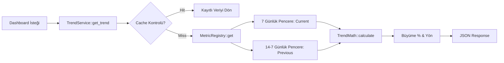

  

:::info Amaç
Bu sayfa, dashboard üzerinde gösterilen büyüme oranları, eğilim verileri ve periyodik metriklerin nasıl hesaplandığını açıklar. `TrendService`, sistemin "Analitik Zekası" olarak görev yapar.
:::

# 📈 TrendService ve Metrik Altyapısı

`TrendService`, dinamik metrikleri (Rezervasyonlar, Mesajlar, Pickup'lar vb.) belirli zaman pencereleri içinde analiz eden merkezi bir motorudur.

---

## 🏗️ Mimari Yapı

Sistem, genişletilebilir bir metrik yapısı sunar:
1.  **MetricRegistry:** Her metrik (örn: `total_bookings`), kendi hesaplama mantığını barındıran bir sınıf olarak sisteme kaydedilir.
2.  **TrendService:** Kayıtlı metrikleri kullanarak "Geçen Hafta" vs "Bu Hafta" karşılaştırması yapar.
3.  **TrendMath:** Karşılaştırma sonuçlarını yüzde (%) büyüme ve yön (Yukarı/Aşağı) bilgisine dönüştürür.

---

## 🔄 Metrik Hesaplama Akışı

---

## ⏱️ Zaman Pencereleri (Windowing)

`TrendService`, karşılaştırmalı analiz yapmak için iki adet **7 günlük** pencere kullanır:
-   **Current Period:** Son 7 gün (Bugün dahil).
-   **Previous Period:** Önceki 7 gün (7 gün öncesinden başlayarak 14 gün öncesine kadar).

Bu yapı, kullanıcıya "Geçen haftaya göre %X büyüme/düşüş" verisi sunar.

---

## 📋 Mevcut Metrik Tipleri

| Metrik Anahtarı | Context | Açıklama |
| :--- | :--- | :--- |
| `total_bookings` | `customer` | Kullanıcının toplam ve son dönem rezervasyon sayısı. |
| `upcoming_pickups`| `customer` | Gelecek 7 gün içindeki araç teslim alma (Pickup) sayısı. |
| `unread_messages` | `customer` | Satıcıdan gelen henüz okunmamış mesaj trendi. |
| `net_revenue` | `vendor` | Satıcının hakediş büyüme eğilimi (Ledger tabanlı). |

---

## ⚡ Performans ve Caching

Metrik hesaplamaları, özellikle büyük veritabanlarında `WP_Query` yükü oluşturabilir. `MetricCacheManager` sayesinde:
-   Hesaplanan trendler **1 saat** boyunca transient olarak saklanır.
-   Cache anahtarları `context`, `metric` ve `subject_id` (User ID/Email) bazlıdır.
-   Yeni bir rezervasyon veya mesaj geldiğinde ilgili cache otomatik olarak düşürülür (Invalidation).

## Bölüm Sonu Özeti
-   Trendler her zaman **7 günlük karşılaştırma** üzerinden çalışır.
-   `MetricRegistry` sayesinde yeni metrik tipleri kolayca eklenebilir.
-   Tüm veriler sanallaştırılmış bir **Cache Katmanı** üzerinden sunulur.

## Değişiklik Günlüğü
| Tarih | Sürüm | Not |
|---|---|---|
| 19.03.2026 | 4.21.2 | Sayfa, TrendService ve MetricRegistry mimarisine göre baştan yazıldı. |
