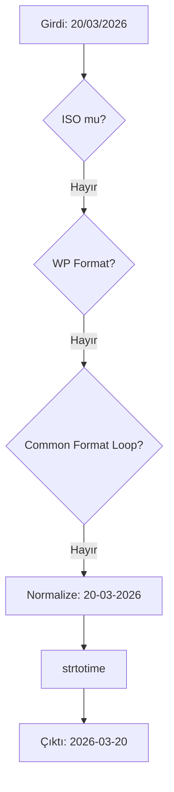

  

:::info Amaç
Bu döküman, `SecurityHelper::validate_date` metodunun çalışma prensiplerini ve Rentiva ekosistemindeki tarih normalizasyonu standartlarını açıklar.
:::

# 📅 Tarih Doğrulama ve Normalizasyon

Rentiva'da tarihler farklı formatlarda (UI, API, DatePicker) gelebilir. `SecurityHelper::validate_date` metodu, tüm bu girdileri standart **ISO (YYYY-MM-DD)** formatına dönüştüren "Güvenli Kapı" görevini görür.

---

## 🛠️ Doğrulama Hiyerarşisi

Metod, gelen veriyi aşağıdaki sırayla normalize etmeye çalışır:

1.  **ISO Kontrolü:** Eğer veri halihazırda `YYYY-MM-DD` formatındaysa doğrudan döner.
2.  **WP Date Format:** WordPress ayarlarındaki `date_format` (örn: `d/m/Y`) değerine göre parse etmeye çalışır.
3.  **Yaygın Formatlar:** `d/m/Y`, `m/d/Y`, `d-m-Y`, `Y/m/d` formatlarını döngüye sokarak denemeler yapar.
4.  **Normalizasyon & Fallback:** Seperatörleri (`.`, `/`, ` `) `-` karakterine dönüştürerek `strtotime` ile son bir deneme yapar.

---

## 🔄 Akış Diyagramı



---

## 💻 Kullanım Örneği

```php
use MHMRentiva\Admin\Core\SecurityHelper;

try {
    // Farklı formatlarda doğrulama
    $date1 = SecurityHelper::validate_date('2026-01-01'); // Returns '2026-01-01'
    $date2 = SecurityHelper::validate_date('31/12/2025'); // Returns '2025-12-31'
    $date3 = SecurityHelper::validate_date('2025.05.20'); // Returns '2025-05-20'
} catch (\InvalidArgumentException $e) {
    // Hatalı format yönetimi
    AdvancedLogger::error('Geçersiz tarih denemesi: ' . $e->getMessage());
}
```

---

## 🛡️ Güvenlik ve Hata Yönetimi

-   **Strict Validation:** Eğer hiçbir format eşleşmezse metot bir `InvalidArgumentException` fırlatır.
-   **Null Safety:** Girdi boş veya null ise `sanitize_text_field_safe` üzerinden temizlenerek hata fırlatılır.
-   **Timezone:** Son çıktı her zaman `gmdate('Y-m-d')` üzerinden UTC bazlı üretilir.

## Bölüm Sonu Özeti
-   Tüm tarih girdileri `validate_date` süzgecinden geçirilmelidir.
-   Çıktı her zaman **ISO (YYYY-MM-DD)** formatında bir string'dir.
-   Hata durumunda uygulama akışını kesen `Exception` fırlatılır.

## Değişiklik Günlüğü
| Tarih | Sürüm | Not |
|---|---|---|
| 19.03.2026 | 4.21.2 | SecurityHelper::validate_date normalizasyon ve fallback mantığına göre güncellendi. |
