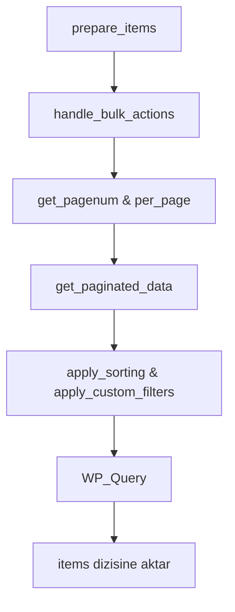

  

:::info Amaç
Bu sayfa, Rentiva yönetim panelindeki tüm tabloların temelini oluşturan `AbstractListTable` sınıfını ve veri listeleme standartlarını açıklar.
:::

# 📋 Liste Tablo Standartları

Rentiva, WordPress'in yerleşik `WP_List_Table` sınıfını modernize eden ve kod tekrarını önleyen bir **Abstract (Soyut)** katman kullanır.

---

## 🏗️ AbstractListTable Mimarisi

`AbstractListTable`, tüm alt tabloların (Ödemeler, Müşteriler, Mesajlar vb.) ortak ihtiyaçlarını merkezi olarak yönetir:
- **Otomatik Sayfalama:** `set_pagination_args` üzerinden limit ve offset yönetimi.
- **Sıralama (Sorting):** Kolon bazlı ASC/DESC mantığının otomatik uygulanması.
- **Arama (Search):** `s` parametresi ile global arama entegrasyonu.
- **Güvenlik (Nonce):** Toplu işlemlerde otomatik nonce doğrulaması.

---

## 🛠️ Bir Liste Tablosu Oluşturma

Sisteme yeni bir tablo eklemek için `AbstractListTable` sınıfı extend edilmeli ve aşağıdaki metodlar implement edilmelidir:

| Metot | Sorumluluk |
| :--- | :--- |
| `get_singular_name()` | Tekil isim (örn: `payout`). |
| `get_plural_name()` | Çoğul isim (örn: `payouts`). |
| `get_data_query_args()` | Veri çekme argümanları (`WP_Query` uyumlu). |
| `get_total_count()` | Toplam kayıt sayısı (Sayfalama için). |
| `process_bulk_action()` | Toplu işlem mantığı (Onaylama, Silme vb.). |

---

## 🔄 Veri Hazırlama Akışı

---

## 🧩 Hazır Yardımcı Metotlar (Helpers)

Alt sınıflar, karmaşık HTML yapıları yerine hazır metodları kullanabilir:
- **`render_status_badge()`:** Durum kodlarını renkli badge'lere dönüştürür.
- **`format_price()`:** Para birimi ve binlik ayracı formatlaması.
- **`render_row_actions()`:** Düzenle/Sil gibi hızlı aksiyon linklerini oluşturur.
- **`create_view_link()`:** Belirli bir öğenin detay sayfasına güvenli link sağlar.

## 🛡️ Güvenlik Protokolü

- **Nonce Enforcement:** Tüm bulk action'lar `mhm_listtable_nonce` üzerinden doğrulanır.
- **Redirects:** Toplu işlem sonrası "Form Resubmission" hatasını önlemek için `wp_safe_redirect` kullanılır.
- **Sanitization:** Tabloya gelen tüm filtre parametreleri `sanitize_text_field_safe` üzerinden geçirilir.

## Bölüm Sonu Özeti
- Yeni tablolar mutlaka `AbstractListTable` sınıfını kullanmalıdır.
- Veri çekme mantığı `get_data_query_args` içinde kapsüllenmelidir.
- Tüm çıktı katmanlarında `safe_output` veya WordPress escaping fonksiyonları zorunludur.

## Değişiklik Günlüğü
| Tarih | Sürüm | Not |
|---|---|---|
| 19.03.2026 | 4.21.2 | Sayfa, AbstractListTable merkezi mimarisine göre baştan yazıldı. |
