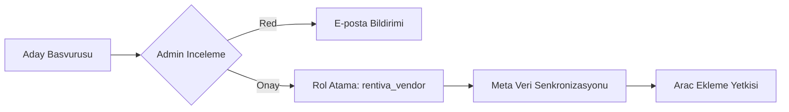
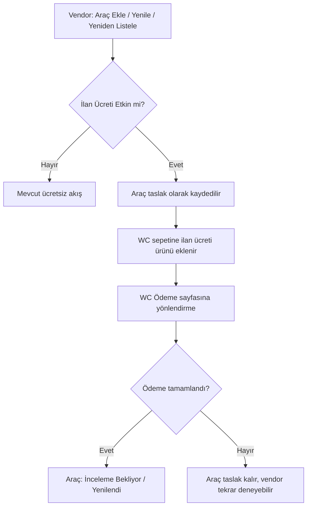

  

:::info Amaç
Rentiva, merkezi bir araç kiralama sisteminden çoklu tedarikçili (Multi-Vendor) bir pazar yerine dönüşebilir. Bu doküman, tedarikçi döngüsünü teknik detaylarıyla açıklar.
:::

# 🤝 Tedarikçi Yönetimi

Sistemde bir kullanıcının "Vendor" (Tedarikçi) olması için geçmesi gereken aşamalar ve bu sürecin arkasındaki teknik yapılar aşağıda özetlenmiştir.

---

## 🏗️ 1. Tedarikçi Rolü ve Yetkilendirme

### `rentiva_vendor` Rolü
Onaylı her tedarikçiye atanan bu rol, şu yetkileri (capabilities) beraberinde getirir:
- `edit_posts`: Kendi araçlarını ekleyebilir.
- `upload_files`: Araç görselleri yükleyebilir.
- `read`: Vendor paneline erişebilir.

### 🛡️ Mülkiyet Zorunluluğu (`VendorOwnershipEnforcer`)
Tedarikçilerin birbirlerinin araçlarına veya rezervasyonlarına erişmesini engellemek için `user_has_cap` filtresi kullanılır:
- Bir vendor sadece `post_author` değeri kendi `user_id`'si ile eşleşen `vehicle` kayıtlarını düzenleyebilir.
- Admin portalında "All Vehicles" listesi vendor için sadece kendi kayıtlarına filtrelenir.

---

## 📋 2. Başvuru Yönetimi (`mhm_vendor_app`)

Tedarikçi adaylarının verileri `mhm_vendor_app` Custom Post Type (CPT) içinde saklanır:
- **Onboarding Akışı:** `Pending` (İnceleme) → `Approved` (Onaylandı) / `Rejected` (Reddedildi).
- **Veri Güvenliği:** Başvuru sırasında alınan IBAN bilgileri `VendorApplicationManager::encrypt_iban()` ile **AES-256-CBC** metoduna göre şifrelenir.
- **Evrak Takibi:** Kimlik, ehliyet ve ikametgah belgeleri `_vendor_doc_*` meta anahtarları altında WordPress Media Library ile ilişkilendirilir.

---

## ⚙️ 3. Operasyonel Kontroller

### Onay ve Meta Senkronizasyonu (`VendorOnboardingController`)
Admin bir başvuruyu onayladığında:
1. `mhm_vendor_app` kaydındaki telefon, şehir ve IBAN bilgileri kullanıcının (WP_User) meta tablolarına kopyalanır.
2. Kullanıcının rolü `customer`'dan `rentiva_vendor`'a yükseltilir.
3. `mhm_rentiva_vendor_approved` kancası (hook) tetiklenerek hoş geldin e-postası gönderilir.

### Profil Yonetimi (`VendorProfileExtension`)
WordPress profil sayfasi (`wp-admin/profile.php`), vendorlara ozel alanlarla genisletilmistir:
- **Magaza Bilgileri:** Bio, vergi numarasi ve hizmet bolgeleri.
- **Finansal Bilgiler:** Maskelenmis IBAN gorunumu (orn: TR***5678).

### Vendor Ayarlar Sayfasi (v4.23.1)

Vendor panelindeki ayarlar sayfasi (`vendor-settings.php`) v4.23.1 ile tamamen yeniden tasarlandi:

- **CSS Mimarisi:** Tum inline stiller kaldirildi, `.mhm-vendor-form__*` CSS sinif yapisi ile `vendor-forms.css` dosyasina tasindi.
- **Yeni Alanlar:** Hesap Sahibi (Account Holder) ve Vergi Dairesi (Tax Office) alanlari eklendi.
- **Sehir Secimi:** Metin girisi yerine SelectWoo bileseni (`CityHelper::render_select()`) kullanilir.
- **Bildirim Sistemi:** Basari/hata bildirimleri `mhm-vendor-notice` sinif yapisi ile standartlastirildi.

:::tip Teknik Not
Vendor ayarlar sayfasindaki tum form alanlari `.mhm-vendor-form__group`, `.mhm-vendor-form__label`, `.mhm-vendor-form__input` gibi BEM-benzeri siniflarla stillendirilir. Yeni alan eklemek icin ayni sinif yapisini takip edin.
:::

---

## Yasam Dongusu Ozeti

---

## 🚐 5. Vendor Transfer Lokasyon ve Rota Yönetimi (v4.23.0)

v4.23.0 ile birlikte vendor'lar, transfer hizmetleri için lokasyon ve rota seçimi yapabilir:

### Şehir Bazlı Filtreleme
Vendor araç ekleme formunda (`[rentiva_vehicle_submit]`), yalnızca vendor'un başvurusunda belirttiği **şehirdeki lokasyonlar** ve **rotalar** listelenir. Bu, **Şehir → Nokta** hiyerarşisinin bir parçasıdır.

### Rota Bazlı Fiyatlandırma
- Vendor, hizmet vermek istediği rotaları seçer.
- Her rota için admin'in belirlediği `min_price` — `max_price` aralığında kendi fiyatını girer.
- Kapasite bilgileri (yolcu, bagaj) araç düzeyinde tanımlanır.

### Meta Yapısı
- `_mhm_rentiva_transfer_locations`: Vendor'un hizmet verdiği lokasyonlar (array)
- `_mhm_rentiva_transfer_routes`: Vendor'un hizmet verdiği rotalar (array)
- `_mhm_rentiva_transfer_route_prices`: Rota bazlı vendor fiyatları (JSON)

### Admin Görünümü
Admin araç düzenleme ekranında (`VehicleTransferMetaBox`), vendor'un şehir bilgisi ve seçtiği lokasyon/rotalar görüntülenir.

---

## 🔄 Araç Yaşam Döngüsü Yönetimi (v4.24.0)

v4.24.0 ile kapsamlı araç yaşam döngüsü sistemi uygulanmıştır:

| Özellik | Detay |
|---------|-------|
| **Durumlar** | Aktif / Duraklatıldı / Geri Çekildi / Süresi Doldu / İnceleme Bekliyor |
| **Listeleme süresi** | 90 gün (admin ayarlanabilir), vendor tarafından yenilenebilir |
| **İptal ceza sistemi** | Kademeli ceza puanları (2. çekilme %10, 3.+ %25) |
| **Güvenilirlik skoru** | 0-100 arası performans değerlendirmesi |
| **Soğuma süresi** | Geri çekilmeden sonra 7 gün bekleme |
| **Anti-gaming** | İptal edilen rezervasyon tarihlerinin 30 gün engellenmesi |

### Vendor Araç Kartlarında Kalan Süre Gösterimi (v4.24.1)

Vendor panelindeki araç listesinde her araç kartında kalan listeleme süresi gösterilir:

| Durum | Gösterim | Renk |
|-------|----------|------|
| > %50 süre kaldı | "Kalan: X gün" | 🟢 Yeşil |
| %20–%50 süre kaldı | "Kalan: X gün" | 🟡 Sarı |
| < %20 süre kaldı | "Kalan: X gün" | 🔴 Kırmızı |
| Süresi dolmuş | "Süresi Doldu" rozeti | — |

**CSS sınıfları:** `.mhm-vendor-listing-card__remaining` ve `.is-green`, `.is-yellow`, `.is-red` varyantları.

---

## 💰 Ücretli İlan Sistemi (v4.24.1)

Vendor'ların araç ilanı yayınlaması için WooCommerce üzerinden ödeme yapması gerekebilir. Bu özellik admin tarafından açılıp kapatılabilir.

### Admin Ayarları (Ayarlar → Vendor Marketplace → İlan Ücreti)

| Ayar | Tip | Varsayılan | Açıklama |
|------|-----|-----------|----------|
| İlan Ücretini Etkinleştir | Checkbox | Kapalı | Ücretli ilan sistemini aç/kapat |
| Ücret Modeli | Select | Tek Seferlik | `one_time` (tek seferlik) veya `per_period` (her 90 günlük dönem) |
| İlan Ücreti Tutarı | Sayı | 0 | Mağaza para biriminde ücret tutarı |

### Ödeme Akışı

### Tetik Noktaları

| Eylem | Ücretsiz Akış | Ücretli Akış |
|-------|---------------|-------------|
| **Yeni Araç** | Form → İnceleme Bekliyor | Form → Taslak → WC Ödeme → İnceleme Bekliyor |
| **Yenileme** (süresi dolmuş) | AJAX → Yaşam döngüsü yenileme | AJAX → WC Ödeme → Yaşam döngüsü yenileme |
| **Yeniden Listeleme** (geri çekilmiş) | AJAX → Yaşam döngüsü yeniden listeleme | AJAX → WC Ödeme → Yaşam döngüsü yeniden listeleme |

### WooCommerce Ürünü

- **Tip:** `WC_Product_Simple` (sanal, gizli)
- **SKU:** `mhm-rentiva-listing-fee`
- **Görünürlük:** Mağazada gizli (shop/arama sonuçlarında gösterilmez)
- **Fiyat:** Admin ayarlarından dinamik olarak okunur
- **Sepet meta:** `_mhm_listing_vehicle_id`, `_mhm_listing_action` (new/renew/relist)
- **Otomatik oluşturma:** Özellik ilk etkinleştirildiğinde otomatik oluşturulur

### Büyükbaba Kuralı (Grandfather Rule)

- Özellik etkinleştirildiğinde mevcut aktif araçlar etkilenmez
- 90 günlük listeleme süreleri dolduğunda yenileme ödemesi gerekir
- Geriye dönük ücret uygulanmaz

### Komisyon İlişkisi

İlan ücreti ve komisyon **birbirinden bağımsızdır:**
- Vendor, ilan ücreti öder (ön ödeme, ilan başına)
- Vendor, komisyon öder (yüzde, rezervasyon başına)
- İkisi arasında indirim veya mahsup yoktur

### Teknik Sınıf

**`ListingFeeManager`** (`src/Admin/Vehicle/ListingFeeManager.php`):
- `is_enabled()` — Özellik aktif mi kontrol eder
- `requires_payment(string $action)` — Belirtilen eylem için ödeme gerekiyor mu
- `get_or_create_product()` — WC ürünü oluşturur veya mevcut olanı döner
- `add_to_cart(int $vehicle_id, string $action)` — Sepete ekler, ödeme URL'si döner
- `on_order_completed()` — Sipariş tamamlandığında aracı yayına alır

---

## 🔗 WooCommerce Hesabım — Satıcı Paneli Menü Linki (v4.24.1)

Vendor rolündeki kullanıcılar WooCommerce Hesabım sayfasında sidebar'da **"Satıcı Paneli"** menü linkini görür. Bu link `/panel/` sayfasına yönlendirir.

| Kullanıcı Rolü | Menü Öğesi | URL |
|----------------|------------|-----|
| `rentiva_vendor` | Satıcı Paneli | `/panel/` |
| Diğer roller (customer, vb.) | Satıcı Olun | `/hesabim/vendor-apply/` |

**Teknik Detay:**
- `WooCommerceIntegration::add_menu_items()` — Vendor rolü kontrolü ile menü öğesi değiştirilir
- `WooCommerceIntegration::vendor_panel_endpoint_url()` — `vendor-panel` endpoint'ini `/panel/` sayfasına yönlendirir
- Vendor başvuru URL slug'ı `_x()` fonksiyonu ile çevrilebilir (SEO uyumlu)

---

## Bilinen Sorunlar (v4.23.1 Keşfedilen)

| Sorun | Detay | Durum |
|-------|-------|-------|
| Arac durumu filtresi | `_mhm_vehicle_status` arama sorgularinda kontrol edilmiyor — bakimdaki araclar gorunur. | Kesfedildi |
| Vendor askiya alma | `VendorOnboardingController::suspend()` vendor araclarini yayindan kaldirmiyor. | Kesfedildi |

---

## Bölüm Sonu Özeti
- `VendorOwnershipEnforcer` ile veri izolasyonu garanti altına alınmıştır.
- Tüm kritik başvuru verileri şifrelenmiş olarak saklanır.
- `rentiva_vendor` yetkileri sadece kendi mülkiyetindeki postlar için geçerlidir.
- Vendor'lar yalnızca kendi şehirlerindeki lokasyonlara ve rotalara erişebilir. *(v4.23.0)*
- Vendor ayarlar sayfası BEM-benzeri CSS sınıf yapısı ile yeniden tasarlandı. *(v4.23.1)*
- Şehir seçimi tüm formlarda SelectWoo bileşeni ile yapılır. *(v4.23.1)*
- Araç yaşam döngüsü sistemi (90 gün listeleme, duraklatma, yenileme, geri çekilme) uygulandı. *(v4.24.0)*
- Ücretli ilan sistemi: WooCommerce checkout tabanlı ödeme kapısı, admin ayarlanabilir. *(v4.24.1)*
- Vendor araç kartlarında kalan süre gösterimi (renk kodlu). *(v4.24.1)*
- WC Hesabım menüsünde vendor'lar için "Satıcı Paneli" linki eklendi. *(v4.24.1)*

## Değişiklik Günlüğü
| Tarih | Sürüm | Not |
|---|---|---|
| 01.04.2026 | 4.24.1 | Ücretli ilan sistemi (ListingFeeManager), kalan süre gösterimi, WC Hesabım "Satıcı Paneli" menü linki, 18 yeni test. |
| 29.03.2026 | 4.24.0 | Araç yaşam döngüsü sistemi uygulandı (Faz 0-4, 6-7). Duraklatma, yenileme, geri çekilme, güvenilirlik skoru. |
| 28.03.2026 | 4.23.1 | Vendor ayarlar sayfası yeniden tasarımı, Hesap Sahibi ve Vergi Dairesi alanları, şehir SelectWoo migrasyonu. |
| 26.03.2026 | 4.23.0 | Vendor Transfer Lokasyon/Rota yönetimi, Şehir→Nokta hiyerarşisi ve rota bazlı fiyatlandırma eklendi. |
| 19.03.2026 | 4.21.2 | CPT, Enforcer ve Onboarding detayları eklendi. |
